# AI CTF Challenge Platform - Activity Diagram

## Overview

This document contains the comprehensive activity diagram for the AI-Powered Platform for Automated CTF Challenge Generation and Deployment. The activity diagram illustrates the dynamic behavior and workflow of the system, showing the sequence of activities, decision points, and parallel processes.

---

## Main Activity Diagram

The main activity diagram covers the complete user journey from registration to challenge creation, deployment, and access.

```mermaid
flowchart TD
    Start([Start])
    End([End])
    
    %% Registration and Authentication Flow
    Start --> CheckAccount{User has account?}
    CheckAccount -->|No| Register[Register Account]
    CheckAccount -->|Yes| Login[Login to Platform]
    
    Register --> ValidateReg{Validate Registration Data}
    ValidateReg -->|Invalid| Register
    ValidateReg -->|Valid| SaveUser[Save User to Database]
    SaveUser --> GenerateToken[Generate JWT Token]
    GenerateToken --> CreateSession[Create User Session]
    CreateSession --> Dashboard
    
    Login --> ValidateCred{Validate Credentials}
    ValidateCred -->|Invalid| Login
    ValidateCred -->|Valid| VerifyAccount{Account Active?}
    VerifyAccount -->|No| End
    VerifyAccount -->|Yes| GenerateToken
    
    %% Dashboard and Main Menu
    Dashboard[View Dashboard]
    Dashboard --> MainMenu{Select Action}
    
    %% Profile Management Flow
    MainMenu -->|Manage Profile| ViewProfile[View Profile]
    ViewProfile --> EditProfile{Edit Profile?}
    EditProfile -->|Yes| UpdateProfile[Update Profile Information]
    UpdateProfile --> ValidateProfile{Validate Changes}
    ValidateProfile -->|Invalid| UpdateProfile
    ValidateProfile -->|Valid| SaveProfile[Save Profile to Database]
    SaveProfile --> Dashboard
    EditProfile -->|No| Dashboard
    
    %% Browse Challenges Flow
    MainMenu -->|Browse Challenges| BrowseChallenges[Browse Challenges]
    BrowseChallenges --> FilterChallenges{Apply Filters?}
    FilterChallenges -->|Yes| ApplyFilters[Apply Search/Filter]
    ApplyFilters --> DisplayChallenges[Display Challenge List]
    FilterChallenges -->|No| DisplayChallenges
    DisplayChallenges --> SelectChallenge{Select Challenge?}
    SelectChallenge -->|Yes| ViewDetails[View Challenge Details]
    SelectChallenge -->|No| Dashboard
    ViewDetails --> ChallengeActions{Action on Challenge?}
    ChallengeActions -->|Deploy| DeployFlow
    ChallengeActions -->|Access| AccessFlow
    ChallengeActions -->|Back| BrowseChallenges
    
    %% Challenge Creation Flow
    MainMenu -->|Create Challenge| OpenChat[Open Chat Interface]
    OpenChat --> EnterRequest[Enter Challenge Request]
    EnterRequest --> SaveMessage[Save User Message to Database]
    SaveMessage --> ForwardRequest[Forward to CTF Automation Service]
    ForwardRequest --> ClassifyIntent[Classifier Agent: Analyze Intent]
    ClassifyIntent --> IntentType{Intent Type?}
    
    IntentType -->|CREATE| CreateFlow
    IntentType -->|DEPLOY| DeployFlow
    IntentType -->|QUESTION| QuestionFlow
    IntentType -->|CHALLENGE_INFO| InfoFlow
    
    %% Create Challenge Flow
    CreateFlow[Route to Create Agent]
    CreateFlow --> GenerateContent[Send Request to OpenAI API]
    GenerateContent --> ReceiveContent[Receive Challenge Structure]
    ReceiveContent --> ValidateContent[Send to Anthropic for Validation]
    ValidateContent --> ValidationResult{Validation Passed?}
    ValidationResult -->|No| RegenerateContent[Request Regeneration]
    RegenerateContent --> GenerateContent
    ValidationResult -->|Yes| GenerateDockerfiles[Generate Dockerfiles]
    GenerateDockerfiles --> CreateStructure[Create Directory Structure]
    CreateStructure --> CommitFiles[Commit Files to Git]
    CommitFiles --> PushGitHub[Push to GitHub Repository]
    PushGitHub --> PushResult{GitHub Push Success?}
    PushResult -->|No| ErrorGitHub[Display Error Message]
    ErrorGitHub --> EnterRequest
    PushResult -->|Yes| StoreMetadata[Store Challenge Metadata in Database]
    StoreMetadata --> ConfirmCreation[Display Creation Confirmation]
    ConfirmCreation --> PostCreation{Post-Creation Action?}
    PostCreation -->|Save| SaveChallenge[Save Challenge to Database]
    PostCreation -->|Deploy| DeployFlow
    PostCreation -->|Browse| BrowseChallenges
    PostCreation -->|Continue| OpenChat
    SaveChallenge --> Dashboard
    
    %% Deployment Flow
    DeployFlow[Route to Deploy Agent]
    DeployFlow --> RetrieveMetadata[Retrieve Challenge Metadata]
    RetrieveMetadata --> ChallengeExists{Challenge Exists?}
    ChallengeExists -->|No| ErrorNotFound[Display Error: Challenge Not Found]
    ErrorNotFound --> Dashboard
    ChallengeExists -->|Yes| CloneRepo[Clone Challenge from GitHub]
    CloneRepo --> PreValidate[Pre-Deployment Validation]
    PreValidate --> PreValResult{Validation Passed?}
    PreValResult -->|No| AutoFix[Attempt Auto-Fix]
    AutoFix --> FixResult{Auto-Fix Success?}
    FixResult -->|No| ErrorValidation[Display Validation Error]
    ErrorValidation --> Dashboard
    FixResult -->|Yes| PreValidate
    PreValResult -->|Yes| AllocateNetwork[Allocate Subnet and IP Addresses]
    AllocateNetwork --> CreateNetwork[Create Docker Network]
    CreateNetwork --> BuildContainers[Execute docker compose up --build]
    BuildContainers --> BuildResult{Build Success?}
    BuildResult -->|No| AnalyzeError[Analyze Build Error]
    AnalyzeError --> RequestFix[Request AI Fix Suggestions]
    RequestFix --> ApplyFix[Apply Fixes]
    ApplyFix --> RetryCount{Retry Count < 3?}
    RetryCount -->|Yes| BuildContainers
    RetryCount -->|No| ErrorBuild[Display Build Error]
    ErrorBuild --> Dashboard
    BuildResult -->|Yes| WaitHealth[Wait for Containers to be Healthy]
    WaitHealth --> PostValidate[Post-Deployment Validation]
    PostValidate --> PostValResult{Validation Passed?}
    PostValResult -->|No| FixStartup[Fix Startup Scripts]
    FixStartup --> RestartContainers[Restart Containers]
    RestartContainers --> PostValidate
    PostValResult -->|Yes| CreateGuacamoleUser[Create Guacamole User]
    CreateGuacamoleUser --> ConfigGuacamole[Configure Guacamole Connection]
    ConfigGuacamole --> UpdateStatus[Update Deployment Status in Database]
    UpdateStatus --> ReturnURL[Return Guacamole Access URL]
    ReturnURL --> DisplayDeploySuccess[Display Deployment Success]
    DisplayDeploySuccess --> AccessFlow
    
    %% Access Challenge Flow
    AccessFlow[Access Challenge Environment]
    AccessFlow --> GetGuacamoleURL[Retrieve Guacamole Connection URL]
    GetGuacamoleURL --> RedirectGuacamole[Redirect to Guacamole Web Interface]
    RedirectGuacamole --> AuthenticateGuacamole[Guacamole Authenticates Session]
    AuthenticateGuacamole --> EstablishSSH[Establish SSH Connection to Container]
    EstablishSSH --> ConnectionResult{Connection Success?}
    ConnectionResult -->|No| ErrorConnection[Display Connection Error]
    ErrorConnection --> Dashboard
    ConnectionResult -->|Yes| DisplayTerminal[Display Terminal Interface]
    DisplayTerminal --> InteractChallenge[User Interacts with Challenge]
    InteractChallenge --> ChallengeAction{User Action?}
    ChallengeAction -->|Ask Question| QuestionFlow
    ChallengeAction -->|Request Hint| HintFlow
    ChallengeAction -->|Submit Flag| FlagFlow
    ChallengeAction -->|Continue| InteractChallenge
    ChallengeAction -->|Exit| LogSession[Log Session Activity]
    LogSession --> Dashboard
    
    %% Question Flow
    QuestionFlow[Route to Questions Agent]
    QuestionFlow --> ProcessQuestion[Process Question via AI]
    ProcessQuestion --> ReturnAnswer[Return AI Answer]
    ReturnAnswer --> SaveResponse[Save Response to Chat History]
    SaveResponse --> DisplayAnswer[Display Answer in Chat]
    DisplayAnswer --> OpenChat
    
    %% Hint Flow
    HintFlow[Request Hint from AI]
    HintFlow --> GenerateHint[AI Generates Hint]
    GenerateHint --> ReturnHint[Return Hint to User]
    ReturnHint --> SaveHint[Save Hint to Chat History]
    SaveHint --> DisplayHint[Display Hint]
    DisplayHint --> InteractChallenge
    
    %% Flag Submission Flow
    FlagFlow[Submit Flag for Verification]
    FlagFlow --> VerifyFlag[Verify Flag Against Database]
    VerifyFlag --> FlagCorrect{Flag Correct?}
    FlagCorrect -->|Yes| MarkSolved[Mark Challenge as Solved]
    MarkSolved --> UpdateStats[Update User Statistics]
    UpdateStats --> DisplaySuccess[Display Success Message]
    DisplaySuccess --> SaveIfNeeded{Challenge Saved?}
    SaveIfNeeded -->|No| SaveChallenge
    SaveIfNeeded -->|Yes| Dashboard
    FlagCorrect -->|No| DisplayFailure[Display Failure Message]
    DisplayFailure --> InteractChallenge
    
    %% Info Flow
    InfoFlow[Route to Challenge Info Agent]
    InfoFlow --> RetrieveInfo[Retrieve Challenge Information]
    RetrieveInfo --> ReturnInfo[Return Challenge Details]
    ReturnInfo --> SaveInfo[Save to Chat History]
    SaveInfo --> DisplayInfo[Display Information]
    DisplayInfo --> OpenChat
    
    %% Logout Flow
    MainMenu -->|Logout| ConfirmLogout{Confirm Logout?}
    ConfirmLogout -->|No| Dashboard
    ConfirmLogout -->|Yes| InvalidateToken[Invalidate JWT Token]
    InvalidateToken --> DestroySession[Destroy Session Record]
    DestroySession --> ClearCookie[Clear Session Cookie]
    ClearCookie --> RedirectLogin[Redirect to Login Page]
    RedirectLogin --> End
    
    style Start fill:#90EE90
    style End fill:#FFB6C1
    style Dashboard fill:#87CEEB
    style CreateFlow fill:#FFD700
    style DeployFlow fill:#FFA500
    style AccessFlow fill:#98FB98
    style QuestionFlow fill:#DDA0DD
    style FlagFlow fill:#F0E68C
```

---

## Detailed Activity Diagrams

### 1. Challenge Creation Activity Diagram

This diagram focuses specifically on the challenge creation workflow with detailed AI interactions.

### 2. Challenge Deployment Activity Diagram

This diagram details the deployment process including validation, Docker operations, and Guacamole setup.

### 3. User Authentication Activity Diagram

This diagram shows the complete authentication flow including registration and login.

---

## Activity Diagram Elements

### Symbols Used

1. **Start Node** (Filled Circle): Represents the beginning of the activity flow
2. **End Node** (Filled Circle with Border): Represents the end of the activity flow
3. **Activity** (Rounded Rectangle): Represents an action or task performed
4. **Decision Node** (Diamond): Represents a decision point with multiple possible outcomes
5. **Fork Node** (Horizontal Bar): Represents the start of parallel activities
6. **Join Node** (Horizontal Bar): Represents the synchronization of parallel activities
7. **Flow** (Arrow): Represents the transition from one activity to another

### Swimlanes (Implicit)

While the main diagram doesn't explicitly show swimlanes, the activities can be conceptually organized into:

1. **User Swimlane**: User-initiated actions (entering data, clicking buttons)
2. **Frontend Swimlane**: UI rendering and user interaction handling
3. **Backend API Swimlane**: Request processing and routing
4. **CTF Automation Service Swimlane**: AI agent orchestration
5. **External Services Swimlane**: OpenAI, Anthropic, GitHub, Docker, Guacamole

---

## Key Workflows Covered

### 1. User Registration and Authentication
- Account registration with validation
- Login with credential verification
- Session management
- Logout process

### 2. Challenge Creation
- AI-powered challenge generation
- Content validation
- File storage in GitHub
- Database metadata storage

### 3. Challenge Deployment
- Pre-deployment validation
- Docker container orchestration
- Network isolation
- Guacamole access setup

### 4. Challenge Access
- Guacamole connection establishment
- Terminal interaction
- Hint and question handling
- Flag submission and verification

### 5. Profile Management
- View and edit profile
- Password change
- Data validation

### 6. Challenge Browsing
- List challenges
- Filter and search
- View details
- Select actions

---

## Decision Points

The activity diagram includes several critical decision points:

1. **Account Existence**: Determines registration vs. login flow
2. **Validation Results**: Determines if operations can proceed or need correction
3. **API Success**: Determines if external service calls succeeded
4. **Intent Classification**: Routes requests to appropriate AI agents
5. **User Actions**: Determines next steps based on user choices
6. **Flag Verification**: Determines challenge completion status

---

## Parallel Activities

While the current implementation is primarily sequential, potential parallel activities include:

1. **AI API Calls**: OpenAI and Anthropic could theoretically be called in parallel (though current flow uses them sequentially for validation)
2. **Container Health Checks**: Multiple containers can be checked simultaneously
3. **File Operations**: Multiple challenge files can be processed concurrently

---

## Error Handling

The activity diagram includes error handling paths for:

1. **Validation Errors**: Input validation failures with retry options
2. **API Failures**: External service unavailability with retry mechanisms
3. **Build Errors**: Docker build failures with auto-fix attempts
4. **Connection Errors**: Network and service connection failures
5. **Database Errors**: Data persistence failures

---

## Best Practices Applied

1. **Clear Start and End Points**: Each workflow has explicit start and end nodes
2. **Decision Points**: All conditional flows use proper decision nodes
3. **Error Handling**: Alternative paths for error scenarios
4. **Modularity**: Separate diagrams for complex workflows
5. **Consistent Notation**: Standard UML activity diagram symbols
6. **Readability**: Logical flow from top to bottom, left to right
7. **Completeness**: Covers all major use cases from the use case diagram

---

## References

- UML 2.5 Activity Diagram Specification
- Use Case Diagram: `USE_CASE_DIAGRAM_DETAILED.md`
- Project Logic Flow: `PROJECT_LOGIC_FLOW.md`
- System Architecture: `SYSTEM_ARCHITECTURE.md`

---

**Last Updated**: 2025-01-27  
**Version**: 1.0  
**Author**: Based on AI CTF Challenge Platform Requirements

