# ERD - MySQL Database (Guacamole)

## Entity Relationship Diagram

This ERD shows all tables in the Guacamole MySQL database and their relationships.

```mermaid
erDiagram
    guacamole_entity ||--o| guacamole_user : "is"
    guacamole_entity ||--o| guacamole_user_group : "is"
    guacamole_entity ||--o{ guacamole_connection_permission : "has"
    guacamole_entity ||--o{ guacamole_connection_group_permission : "has"
    guacamole_entity ||--o{ guacamole_sharing_profile_permission : "has"
    guacamole_entity ||--o{ guacamole_system_permission : "has"
    guacamole_entity ||--o{ guacamole_user_permission : "has"
    guacamole_entity ||--o{ guacamole_user_group_permission : "has"
    
    guacamole_user ||--o{ guacamole_user_attribute : "has"
    guacamole_user ||--o{ guacamole_user_permission : "affects"
    guacamole_user ||--o{ guacamole_connection_history : "uses"
    guacamole_user ||--o{ guacamole_user_history : "has"
    guacamole_user ||--o{ guacamole_user_password_history : "has"
    
    guacamole_user_group ||--o{ guacamole_user_group_member : "contains"
    guacamole_user_group ||--o{ guacamole_user_group_attribute : "has"
    guacamole_user_group ||--o{ guacamole_user_group_permission : "affects"
    
    guacamole_connection_group ||--o{ guacamole_connection_group : "contains"
    guacamole_connection_group ||--o{ guacamole_connection : "contains"
    guacamole_connection_group ||--o{ guacamole_connection_group_attribute : "has"
    guacamole_connection_group ||--o{ guacamole_connection_group_permission : "has"
    
    guacamole_connection ||--o{ guacamole_connection_parameter : "has"
    guacamole_connection ||--o{ guacamole_connection_attribute : "has"
    guacamole_connection ||--o{ guacamole_connection_permission : "has"
    guacamole_connection ||--o{ guacamole_connection_history : "used in"
    guacamole_connection ||--o{ guacamole_sharing_profile : "shared via"
    
    guacamole_sharing_profile ||--o{ guacamole_sharing_profile_parameter : "has"
    guacamole_sharing_profile ||--o{ guacamole_sharing_profile_attribute : "has"
    guacamole_sharing_profile ||--o{ guacamole_sharing_profile_permission : "has"
    guacamole_sharing_profile ||--o{ guacamole_connection_history : "used via"
    
    guacamole_entity {
        int entity_id PK
        string name
        string type
    }
    
    guacamole_user {
        int user_id PK
        int entity_id FK
        string password_hash
        boolean disabled
        boolean expired
        string full_name
        string email_address
    }
    
    guacamole_user_group {
        int user_group_id PK
        int entity_id FK
        boolean disabled
    }
    
    guacamole_user_group_member {
        int user_group_id PK
        int member_entity_id PK
    }
    
    guacamole_connection_group {
        int connection_group_id PK
        int parent_id FK
        string connection_group_name
        string type
    }
    
    guacamole_connection {
        int connection_id PK
        string connection_name
        int parent_id FK
        string protocol
    }
    
    guacamole_connection_parameter {
        int connection_id PK
        string parameter_name PK
        string parameter_value
    }
    
    guacamole_sharing_profile {
        int sharing_profile_id PK
        string sharing_profile_name
        int primary_connection_id FK
    }
    
    guacamole_sharing_profile_parameter {
        int sharing_profile_id PK
        string parameter_name PK
        string parameter_value
    }
    
    guacamole_user_attribute {
        int user_id PK
        string attribute_name PK
        string attribute_value
    }
    
    guacamole_user_group_attribute {
        int user_group_id PK
        string attribute_name PK
        string attribute_value
    }
    
    guacamole_connection_attribute {
        int connection_id PK
        string attribute_name PK
        string attribute_value
    }
    
    guacamole_connection_group_attribute {
        int connection_group_id PK
        string attribute_name PK
        string attribute_value
    }
    
    guacamole_sharing_profile_attribute {
        int sharing_profile_id PK
        string attribute_name PK
        string attribute_value
    }
    
    guacamole_connection_permission {
        int entity_id PK
        int connection_id PK
        string permission PK
    }
    
    guacamole_connection_group_permission {
        int entity_id PK
        int connection_group_id PK
        string permission PK
    }
    
    guacamole_sharing_profile_permission {
        int entity_id PK
        int sharing_profile_id PK
        string permission PK
    }
    
    guacamole_system_permission {
        int entity_id PK
        string permission PK
    }
    
    guacamole_user_permission {
        int entity_id PK
        int affected_user_id PK
        string permission PK
    }
    
    guacamole_user_group_permission {
        int entity_id PK
        int affected_user_group_id PK
        string permission PK
    }
    
    guacamole_connection_history {
        int history_id PK
        int user_id FK
        int connection_id FK
        timestamp start_date
        timestamp end_date
    }
    
    guacamole_user_history {
        int history_id PK
        int user_id FK
        timestamp start_date
        timestamp end_date
    }
    
    guacamole_user_password_history {
        int password_history_id PK
        int user_id FK
        string password_hash
        timestamp password_date
    }
```

---

## Relationship Details

### **Core Entity Relationships:**

1. **guacamole_entity → guacamole_user** (1:1)
   - One entity can be one user
   - `guacamole_user.entity_id` → `guacamole_entity.entity_id` (ON DELETE CASCADE)

2. **guacamole_entity → guacamole_user_group** (1:1)
   - One entity can be one user group
   - `guacamole_user_group.entity_id` → `guacamole_entity.entity_id` (ON DELETE CASCADE)

3. **guacamole_user_group → guacamole_user_group_member** (1:N)
   - One user group can have many members
   - `guacamole_user_group_member.user_group_id` → `guacamole_user_group.user_group_id` (ON DELETE CASCADE)

### **Connection Relationships:**

4. **guacamole_connection_group → guacamole_connection_group** (1:N - Self-referential)
   - Connection groups can be nested
   - `guacamole_connection_group.parent_id` → `guacamole_connection_group.connection_group_id` (ON DELETE CASCADE)

5. **guacamole_connection_group → guacamole_connection** (1:N)
   - One connection group can contain many connections
   - `guacamole_connection.parent_id` → `guacamole_connection_group.connection_group_id` (ON DELETE CASCADE)

6. **guacamole_connection → guacamole_connection_parameter** (1:N)
   - One connection can have many parameters (hostname, port, username, etc.)
   - `guacamole_connection_parameter.connection_id` → `guacamole_connection.connection_id` (ON DELETE CASCADE)

7. **guacamole_connection → guacamole_sharing_profile** (1:N)
   - One connection can have many sharing profiles
   - `guacamole_sharing_profile.primary_connection_id` → `guacamole_connection.connection_id` (ON DELETE CASCADE)

### **Permission Relationships:**

8. **guacamole_entity → guacamole_connection_permission** (1:N)
   - One entity can have permissions for many connections
   - `guacamole_connection_permission.entity_id` → `guacamole_entity.entity_id` (ON DELETE CASCADE)

9. **guacamole_entity → guacamole_system_permission** (1:N)
   - One entity can have many system permissions
   - `guacamole_system_permission.entity_id` → `guacamole_entity.entity_id` (ON DELETE CASCADE)

10. **guacamole_user → guacamole_user_permission** (1:N)
    - One user can have permissions affecting many users
    - `guacamole_user_permission.affected_user_id` → `guacamole_user.user_id` (ON DELETE CASCADE)

### **History Relationships:**

11. **guacamole_user → guacamole_connection_history** (1:N)
    - One user can have many connection history records
    - `guacamole_connection_history.user_id` → `guacamole_user.user_id` (ON DELETE SET NULL)

12. **guacamole_user → guacamole_user_history** (1:N)
    - One user can have many login/logout history records
    - `guacamole_user_history.user_id` → `guacamole_user.user_id` (ON DELETE SET NULL)

13. **guacamole_user → guacamole_user_password_history** (1:N)
    - One user can have many password change history records
    - `guacamole_user_password_history.user_id` → `guacamole_user.user_id` (ON DELETE CASCADE)

---

## Key Constraints

### **Unique Constraints:**
- `guacamole_entity(type, name)` - UNIQUE
- `guacamole_user.entity_id` - UNIQUE
- `guacamole_user_group.entity_id` - UNIQUE
- `guacamole_connection_group(connection_group_name, parent_id)` - UNIQUE
- `guacamole_connection(connection_name, parent_id)` - UNIQUE
- `guacamole_sharing_profile(sharing_profile_name, primary_connection_id)` - UNIQUE

### **Composite Primary Keys:**
- `guacamole_connection_permission(entity_id, connection_id, permission)`
- `guacamole_connection_group_permission(entity_id, connection_group_id, permission)`
- `guacamole_sharing_profile_permission(entity_id, sharing_profile_id, permission)`
- `guacamole_system_permission(entity_id, permission)`
- `guacamole_user_permission(entity_id, affected_user_id, permission)`
- `guacamole_user_group_permission(entity_id, affected_user_group_id, permission)`

### **Foreign Key Constraints:**
- Most foreign keys use `ON DELETE CASCADE`
- History tables use `ON DELETE SET NULL` to preserve history

---

## Table Count Summary

**Total Tables: 23**

**Core Tables (3):**
1. guacamole_entity (base for users and groups)
2. guacamole_user
3. guacamole_user_group

**Connection Tables (3):**
4. guacamole_connection_group
5. guacamole_connection
6. guacamole_connection_parameter

**Sharing Tables (2):**
7. guacamole_sharing_profile
8. guacamole_sharing_profile_parameter

**Attribute Tables (5):**
9. guacamole_user_attribute
10. guacamole_user_group_attribute
11. guacamole_connection_attribute
12. guacamole_connection_group_attribute
13. guacamole_sharing_profile_attribute

**Permission Tables (6):**
14. guacamole_connection_permission
15. guacamole_connection_group_permission
16. guacamole_sharing_profile_permission
17. guacamole_system_permission
18. guacamole_user_permission
19. guacamole_user_group_permission

**Membership Tables (1):**
20. guacamole_user_group_member

**History Tables (3):**
21. guacamole_connection_history
22. guacamole_user_history
23. guacamole_user_password_history

---

## Important Notes

1. **Entity Model**: Guacamole uses an entity-based permission model where both users and user groups are entities, allowing unified permission management.

2. **Connection Parameters**: Connection settings (hostname, port, username, password) are stored in `guacamole_connection_parameter` as key-value pairs.

3. **Permission Types**: 
   - Connection permissions: READ, UPDATE, DELETE, ADMINISTER
   - System permissions: CREATE_CONNECTION, CREATE_USER, ADMINISTER, etc.

4. **History Preservation**: History tables use `ON DELETE SET NULL` to preserve records even if users/connections are deleted.

---

**Last Updated**: 2025-01-27  
**Database**: MySQL 8.0  
**Status**: Standard Guacamole schema (all 23 tables)

