# ERD - PostgreSQL Database (CTF Platform)

## Entity Relationship Diagram

This ERD shows all tables in use in the PostgreSQL database and their relationships.

```mermaid
erDiagram
    users ||--o{ sessions : "has"
    users ||--o{ challenges : "creates"
    users ||--o{ chat_messages : "sends"
    users ||--o{ challenge_submissions : "submits"
    users ||--o{ user_activity_log : "generates"
    
    sessions ||--o{ chat_messages : "contains"
    sessions ||--o| session_guacamole_users : "maps to"
    sessions ||--o{ session_activity : "tracks"
    sessions ||--o| pending_deployments : "has"
    
    challenges ||--o{ chat_messages : "referenced in"
    challenges ||--o{ challenge_submissions : "receives"
    
    validated_os_images ||--o{ os_image_usage_history : "used in"
    ctf_tools ||--o{ tool_installation_methods : "has"
    ctf_tools ||--o{ tool_package_mappings : "has"
    
    users {
        int user_id PK
        string username UK
        string email UK
        string password_hash
        string name
        string role
        int challenges_solved
        int challenges_created
        timestamp created_at
    }
    
    sessions {
        string session_id PK
        int user_id FK
        timestamp created_at
        timestamp expires_at
        boolean is_active
    }
    
    challenges {
        int challenge_id PK
        string challenge_name
        string slug UK
        int user_id FK
        string category
        string difficulty
        string flag
        boolean is_active
        boolean is_deployed
        timestamp created_at
    }
    
    chat_messages {
        int message_id PK
        string session_id
        int user_id FK
        string role
        string message_text
        int challenge_id FK
        timestamp timestamp
    }
    
    challenge_submissions {
        int submission_id PK
        int challenge_id FK
        int user_id FK
        string submitted_flag
        boolean is_correct
        timestamp submitted_at
    }
    
    pending_deployments {
        string session_id PK
        string challenge_name
        timestamp created_at
    }
    
    session_guacamole_users {
        string session_id PK
        string guacamole_username
        int guacamole_entity_id
        timestamp created_at
    }
    
    session_activity {
        int id PK
        string session_id FK
        string activity_type
        timestamp timestamp
    }
    
    user_activity_log {
        int log_id PK
        int user_id FK
        string activity_type
        timestamp created_at
    }
    
    validated_os_images {
        int id PK
        string image_name UK
        string package_manager
        string os_type
        boolean is_valid
        timestamp created_at
    }
    
    os_image_validation_queue {
        int id PK
        string image_name UK
        string status
        timestamp created_at
    }
    
    os_image_usage_history {
        int id PK
        int image_id FK
        string image_name
        boolean success
        timestamp used_at
    }
    
    ctf_tools {
        int id PK
        string tool_name UK
        string category
        timestamp created_at
    }
    
    tool_installation_methods {
        int id PK
        int tool_id FK
        string method
        string package_name
        boolean requires_sudo
        timestamp created_at
    }
    
    tool_learning_queue {
        int id PK
        string tool_name
        string status
        timestamp created_at
    }
    
    service_package_mappings {
        int id PK
        string service_name UK
        string package_name
        boolean is_valid
        timestamp created_at
    }
    
    tool_package_mappings {
        int id PK
        int tool_id FK
        string tool_name
        string package_name
        timestamp created_at
    }
    
    subnet_allocations {
        int id PK
        string challenge_name
        string subnet UK
        boolean is_active
        timestamp created_at
    }
```

---

## Relationship Details

### **Core Relationships:**

1. **users → sessions** (1:N)
   - One user can have many sessions
   - `sessions.user_id` → `users.user_id` (ON DELETE CASCADE)

2. **users → challenges** (1:N)
   - One user can create many challenges
   - `challenges.user_id` → `users.user_id` (ON DELETE CASCADE)
   - **Critical**: Challenges are private to users

3. **users → challenge_submissions** (1:N)
   - One user can submit flags for many challenges
   - `challenge_submissions.user_id` → `users.user_id` (ON DELETE CASCADE)

4. **sessions → chat_messages** (1:N)
   - One session can have many chat messages
   - `chat_messages.session_id` → `sessions.session_id`

5. **sessions → session_guacamole_users** (1:1)
   - One session maps to one Guacamole user
   - `session_guacamole_users.session_id` → `sessions.session_id` (ON DELETE CASCADE)

6. **sessions → session_activity** (1:N)
   - One session can have many activity records
   - `session_activity.session_id` → `sessions.session_id` (ON DELETE CASCADE)

7. **sessions → pending_deployments** (1:1)
   - One session can have one pending deployment
   - `pending_deployments.session_id` → `sessions.session_id` (ON DELETE CASCADE)

8. **challenges → challenge_submissions** (1:N)
   - One challenge can receive many submissions
   - `challenge_submissions.challenge_id` → `challenges.challenge_id` (ON DELETE CASCADE)

9. **challenges → chat_messages** (1:N)
   - One challenge can be referenced in many chat messages
   - `chat_messages.challenge_id` → `challenges.challenge_id` (ON DELETE SET NULL)

### **CTF Automation Relationships:**

10. **validated_os_images → os_image_usage_history** (1:N)
    - One OS image can be used in many challenges
    - `os_image_usage_history.image_id` → `validated_os_images.id` (ON DELETE SET NULL)

11. **ctf_tools → tool_installation_methods** (1:N)
    - One tool can have many installation methods
    - `tool_installation_methods.tool_id` → `ctf_tools.id` (ON DELETE CASCADE)

12. **ctf_tools → tool_package_mappings** (1:N)
    - One tool can have many package mappings
    - `tool_package_mappings.tool_id` → `ctf_tools.id` (ON DELETE CASCADE)

---

## Key Constraints

### **Unique Constraints:**
- `users.username` - UNIQUE
- `users.email` - UNIQUE
- `challenges.slug` - UNIQUE
- `challenge_submissions(challenge_id, user_id)` - UNIQUE (one submission per user per challenge)
- `validated_os_images.image_name` - UNIQUE
- `os_image_validation_queue.image_name` - UNIQUE
- `ctf_tools.tool_name` - UNIQUE
- `service_package_mappings.service_name` - UNIQUE
- `subnet_allocations.subnet` - UNIQUE
- `subnet_allocations(challenge_name, user_id)` - UNIQUE

### **Foreign Key Constraints:**
- All foreign keys use `ON DELETE CASCADE` except:
  - `chat_messages.challenge_id` → `ON DELETE SET NULL`
  - `os_image_usage_history.image_id` → `ON DELETE SET NULL`

---

## Table Count Summary

**Total Tables: 18**

**Core Application (9):**
1. users
2. sessions
3. challenges
4. chat_messages
5. challenge_submissions
6. pending_deployments
7. session_guacamole_users
8. session_activity
9. user_activity_log

**CTF Automation (9):**
10. validated_os_images
11. os_image_usage_history
12. os_image_validation_queue
13. ctf_tools
14. tool_installation_methods
15. tool_learning_queue
16. service_package_mappings
17. tool_package_mappings
18. subnet_allocations

---

**Last Updated**: 2025-01-27  
**Database**: PostgreSQL  
**Status**: All tables in use

