# AI CTF Challenge Platform - High-Level Architecture

This document provides a simplified, high-level view of the AI CTF Challenge Platform architecture.

---

## 🏗️ High-Level System Architecture

```mermaid
graph TB
    subgraph "👤 User Layer"
        User[User Browser]
    end

    subgraph "🌐 Frontend Layer"
        Frontend[React + TypeScript<br/>Frontend Service<br/>Port: 4000<br/>━━━━━━━━━━━━━━━━<br/>• Dashboard UI<br/>• Chat Interface<br/>• Challenge Management<br/>• Profile & Settings]
    end

    subgraph "🔧 Backend Layer"
        Backend[Express.js<br/>Backend API Service<br/>Port: 4002<br/>━━━━━━━━━━━━━━━━<br/>• Authentication & Authorization<br/>• Session Management<br/>• Chat History Storage<br/>• User Management<br/>• JWT Token Generation]
    end

    subgraph "🤖 CTF Automation Layer"
        CTFAuto[Node.js<br/>CTF Automation Service<br/>Port: 4003<br/>━━━━━━━━━━━━━━━━<br/>• Request Processing<br/>• Agent Orchestration<br/>• Response Formatting]
        
        Classifier[Classifier Agent<br/>Request Classification & Routing]
        CreateAgent[Create Agent<br/>Challenge Generation]
        DeployAgent[Deploy Agent<br/>Deployment Orchestration]
        ValidatorAgent[Validator Agent<br/>Pre/Post Deployment Validation]
        QuestionsAgent[Questions Agent<br/>Q&A Handler]
    end

    subgraph "💾 Database Layer"
        PostgreSQL[(PostgreSQL<br/>Port: 5433<br/>━━━━━━━━━━━━━━━━<br/>• Users & Sessions<br/>• Challenges Metadata<br/>• Chat History<br/>• OS Images & Tools<br/>• Package Mappings)]
        
        MySQL[(MySQL<br/>Port: 3307<br/>━━━━━━━━━━━━━━━━<br/>• Guacamole Users<br/>• Connection Configs<br/>• Connection Parameters)]
    end

    subgraph "🐳 Container Infrastructure Layer"
        DockerEngine[Docker Engine<br/>Docker API<br/>━━━━━━━━━━━━━━━━<br/>• Container Management<br/>• Network Isolation<br/>• Image Building<br/>• Volume Management]
        
        Guacamole[Apache Guacamole<br/>Port: 8081<br/>━━━━━━━━━━━━━━━━<br/>• Browser SSH/RDP Access<br/>• Session Isolation<br/>• Connection Management<br/>• WebSocket Protocol]
        
        ChallengeContainers[Challenge Containers<br/>Isolated Networks<br/>━━━━━━━━━━━━━━━━<br/>• Attacker Machines<br/>Kali Linux with Tools<br/>• Victim Machines<br/>Vulnerable Services<br/>• Network: 172.23.x.x/24]
    end

    subgraph "☁️ External Services Layer"
        GitHub[GitHub Repository<br/>Git API<br/>━━━━━━━━━━━━━━━━<br/>• Challenge Storage<br/>• Version Control<br/>• File Management]
        
        OpenAI[OpenAI API<br/>GPT-4<br/>━━━━━━━━━━━━━━━━<br/>• Challenge Generation<br/>• Code Generation<br/>• Content Creation]
        
        Anthropic[Anthropic API<br/>Claude<br/>━━━━━━━━━━━━━━━━<br/>• AI Assistance<br/>• Validation Logic<br/>• Error Analysis]
    end

    %% User Interactions
    User -->|"HTTP/WebSocket<br/>User Requests,<br/>Display Results"| Frontend
    Frontend -->|"REST API<br/>POST /api/chat<br/>GET /api/challenges<br/>POST /api/auth/login<br/>Returns: JSON Responses,<br/>JWT Tokens"| Backend
    Backend -->|"REST API<br/>POST /api/chat<br/>{message, sessionId}<br/>Returns: AI Response,<br/>Challenge Info"| CTFAuto

    %% CTF Automation Internal Flow
    CTFAuto -->|"Route Request<br/>Classify Intent"| Classifier
    Classifier -->|"Intent: CREATE<br/>Route to Create Agent"| CreateAgent
    Classifier -->|"Intent: DEPLOY<br/>Route to Deploy Agent"| DeployAgent
    Classifier -->|"Intent: QUESTION<br/>Route to Questions Agent"| QuestionsAgent
    DeployAgent -->|"Validate Challenge<br/>Pre/Post Checks"| ValidatorAgent
    ValidatorAgent -->|"Validation Results<br/>Error Reports"| DeployAgent

    %% Database Interactions
    Backend -->|"SQL: INSERT, SELECT, UPDATE<br/>Store Users, Sessions,<br/>Chat History,<br/>Validate JWT Tokens"| PostgreSQL
    PostgreSQL -->|"User Data, Session Info,<br/>Chat Messages,<br/>Challenge Metadata"| Backend
    
    CTFAuto -->|"SQL: SELECT, INSERT, UPDATE<br/>Read Challenge Metadata,<br/>Store OS Images,<br/>Store Tool Installations"| PostgreSQL
    PostgreSQL -->|"Challenge Data,<br/>OS Image Info,<br/>Tool Installation Methods"| CTFAuto
    
    CTFAuto -->|"SQL: INSERT, SELECT<br/>Create Guacamole Users,<br/>Store Connection Configs"| MySQL
    MySQL -->|"Guacamole User Data,<br/>Connection Parameters"| CTFAuto
    
    Guacamole -->|"SQL: SELECT, INSERT, UPDATE<br/>Read Connection Configs,<br/>Store User Sessions"| MySQL
    MySQL -->|"Connection Data,<br/>User Permissions"| Guacamole

    %% Container Management
    CTFAuto -->|"Docker API<br/>docker compose up,<br/>docker network create,<br/>Get Container IPs"| DockerEngine
    DockerEngine -->|"Container Status,<br/>Network Info,<br/>Container IPs"| CTFAuto
    
    DockerEngine -->|"Create Containers,<br/>Attach Networks,<br/>Start Services"| ChallengeContainers
    ChallengeContainers -->|"Container Logs,<br/>Health Status"| DockerEngine
    
    CTFAuto -->|"Guacamole API<br/>Create Connections,<br/>Create Users,<br/>Grant Permissions"| Guacamole
    Guacamole -->|"Connection URLs,<br/>Connection Status"| CTFAuto
    
    Guacamole -->|"SSH/RDP Protocol<br/>WebSocket Connection,<br/>Terminal Access"| ChallengeContainers
    ChallengeContainers -->|"Terminal Output,<br/>Connection Status"| Guacamole

    %% External Service Interactions
    CreateAgent -->|"Git API<br/>git push, git commit<br/>Create Repository,<br/>Push Challenge Files"| GitHub
    GitHub -->|"Repository URL,<br/>Commit Hash,<br/>Push Status"| CreateAgent
    
    DeployAgent -->|"Git API<br/>git clone, git pull<br/>Clone Challenge Repository"| GitHub
    GitHub -->|"Challenge Files,<br/>Docker Compose Configs"| DeployAgent
    
    CreateAgent -->|"OpenAI API<br/>POST /v1/chat/completions<br/>Generate Challenge Content,<br/>Create Dockerfiles"| OpenAI
    OpenAI -->|"Generated Content,<br/>AI Responses"| CreateAgent
    
    CreateAgent -->|"Anthropic API<br/>POST /v1/messages<br/>Generate Challenge Logic,<br/>Validate Structure"| Anthropic
    Anthropic -->|"AI Responses,<br/>Validation Results"| CreateAgent
    
    DeployAgent -->|"OpenAI API<br/>Error Analysis,<br/>Fix Suggestions"| OpenAI
    OpenAI -->|"Error Fixes,<br/>Code Suggestions"| DeployAgent
    
    DeployAgent -->|"Anthropic API<br/>Deployment Validation,<br/>Error Resolution"| Anthropic
    Anthropic -->|"Validation Results,<br/>Fix Recommendations"| DeployAgent

    %% Styling
    style User fill:#e1f5ff,stroke:#01579b,stroke-width:3px
    style Frontend fill:#c8e6c9,stroke:#2e7d32,stroke-width:3px
    style Backend fill:#fff9c4,stroke:#f57f17,stroke-width:3px
    style CTFAuto fill:#f8bbd0,stroke:#c2185b,stroke-width:3px
    style PostgreSQL fill:#b39ddb,stroke:#4a148c,stroke-width:3px
    style MySQL fill:#b39ddb,stroke:#4a148c,stroke-width:3px
    style DockerEngine fill:#90caf9,stroke:#0d47a1,stroke-width:3px
    style Guacamole fill:#a5d6a7,stroke:#1b5e20,stroke-width:3px
    style ChallengeContainers fill:#ffccbc,stroke:#bf360c,stroke-width:3px
    style GitHub fill:#ffccbc,stroke:#bf360c,stroke-width:3px
    style OpenAI fill:#ffccbc,stroke:#bf360c,stroke-width:3px
    style Anthropic fill:#ffccbc,stroke:#bf360c,stroke-width:3px
    style Classifier fill:#e1bee7,stroke:#4a148c,stroke-width:2px
    style CreateAgent fill:#c5e1a5,stroke:#33691e,stroke-width:2px
    style DeployAgent fill:#ffab91,stroke:#bf360c,stroke-width:2px
    style ValidatorAgent fill:#ffe082,stroke:#f57f17,stroke-width:2px
    style QuestionsAgent fill:#b2dfdb,stroke:#004d40,stroke-width:2px
```



---

## 🔗 Detailed Component Interactions

```mermaid
graph LR
    subgraph "Frontend Layer"
        React[React + TypeScript<br/>Vite Build Tool]
    end

    subgraph "Backend Layer"
        Express[Express.js<br/>REST API Server]
        JWT[JWT Authentication<br/>jsonwebtoken<br/>━━━━━━━━━━━━━━━━<br/>• Create tokens after login<br/>• Verify tokens on requests<br/>• Session management<br/>• Token expiration (7 days)]
        Bcrypt[Password Hashing<br/>bcryptjs<br/>━━━━━━━━━━━━━━━━<br/>• Hash passwords (one-way)<br/>• Compare passwords on login<br/>• Secure password storage<br/>• Never store plain text]
    end

    subgraph "CTF Automation Layer"
        NodeJS[Node.js<br/>CTF Service]
        Agents[AI Agent System<br/>Multi-Agent Architecture]
    end

    subgraph "Database Layer"
        PG[(PostgreSQL<br/>pg Library)]
        MySQL_DB[(MySQL<br/>mysql2 Library)]
    end

    subgraph "Container Layer"
        Docker[Docker Engine<br/>dockerode Library]
        GuacAPI[Guacamole API<br/>REST + Database]
    end

    subgraph "External APIs"
        GitAPI[GitHub API<br/>@octokit/rest]
        OpenAIClient[OpenAI SDK<br/>openai]
        AnthropicClient[Anthropic SDK<br/>@anthropic-ai/sdk]
    end

    React -->|"HTTP Requests<br/>POST /api/auth/login<br/>POST /api/chat<br/>GET /api/challenges<br/>Returns: JSON, JWT Tokens"| Express
    Express -->|"Generate Token<br/>jwt.sign()<br/>After successful login<br/>Verify Token<br/>jwt.verify()<br/>On protected routes"| JWT
    JWT -->|"Token Created<br/>Token Verified<br/>User Authenticated"| Express
    Express -->|"Hash Password<br/>bcrypt.hash()<br/>During registration<br/>Compare Password<br/>bcrypt.compare()<br/>During login"| Bcrypt
    Bcrypt -->|"Password Hashed<br/>Password Valid<br/>Password Invalid"| Express
    Express -->|"SQL Queries<br/>pg.Pool<br/>Connection Pool"| PG
    Express -->|"HTTP Proxy<br/>POST /api/chat<br/>Forward Requests"| NodeJS
    
    NodeJS -->|"Route Requests<br/>Agent Selection"| Agents
    Agents -->|"SQL Queries<br/>Read/Write Data"| PG
    Agents -->|"SQL Queries<br/>Guacamole Config"| MySQL_DB
    Agents -->|"Docker API<br/>Container Operations"| Docker
    Agents -->|"REST API<br/>Create Connections"| GuacAPI
    
    Agents -->|"Git Operations<br/>Clone, Push, Commit"| GitAPI
    Agents -->|"AI Requests<br/>Chat Completions"| OpenAIClient
    Agents -->|"AI Requests<br/>Messages API"| AnthropicClient
    
    Docker -->|"Container Status<br/>Network Info"| Agents
    GuacAPI -->|"Connection URLs<br/>User Management"| Agents
    GitAPI -->|"Repository Data<br/>File Contents"| Agents
    OpenAIClient -->|"AI Responses<br/>Generated Content"| Agents
    AnthropicClient -->|"AI Responses<br/>Validation Results"| Agents

    style React fill:#c8e6c9,stroke:#2e7d32,stroke-width:2px
    style Express fill:#fff9c4,stroke:#f57f17,stroke-width:2px
    style JWT fill:#ffe082,stroke:#f57f17,stroke-width:2px
    style Bcrypt fill:#ffe082,stroke:#f57f17,stroke-width:2px
    style NodeJS fill:#f8bbd0,stroke:#c2185b,stroke-width:2px
    style Agents fill:#e1bee7,stroke:#4a148c,stroke-width:2px
    style PG fill:#b39ddb,stroke:#4a148c,stroke-width:2px
    style MySQL_DB fill:#b39ddb,stroke:#4a148c,stroke-width:2px
    style Docker fill:#90caf9,stroke:#0d47a1,stroke-width:2px
    style GuacAPI fill:#a5d6a7,stroke:#1b5e20,stroke-width:2px
    style GitAPI fill:#ffccbc,stroke:#bf360c,stroke-width:2px
    style OpenAIClient fill:#ffccbc,stroke:#bf360c,stroke-width:2px
    style AnthropicClient fill:#ffccbc,stroke:#bf360c,stroke-width:2px
```

---

## 📊 Component Overview

### **Application Services**

| Service | Port | Technology | Purpose |
|---------|------|------------|---------|
| **Frontend** | 4000 | React + TypeScript | User interface for dashboard, chat, and challenge management |
| **Backend API** | 4002 | Express.js | Authentication, session management, and data persistence |
| **CTF Automation** | 4003 | Node.js | AI-powered challenge creation and deployment orchestration |

### **AI Agent System**

- **Classifier Agent**: Routes user requests to appropriate handlers
- **Create Agent**: Generates challenges using AI and creates repository structure
- **Deploy Agent**: Orchestrates challenge deployment, container management, and validation
- **Validator Agent**: Pre and post-deployment validation and error detection
- **Questions Agent**: Handles user questions and provides information

### **Data Storage**

- **PostgreSQL** (Port 5433): Main database for users, sessions, challenges, chat history, and system metadata
- **MySQL** (Port 3307): Guacamole-specific database for connection management

### **Infrastructure**

- **Docker Engine**: Container orchestration and network isolation
- **Apache Guacamole** (Port 8081): Browser-based SSH/RDP access to challenge containers
- **Challenge Containers**: Isolated attacker and victim machines in dedicated networks

### **External Integrations**

- **GitHub**: Challenge repository storage and version control
- **OpenAI API**: GPT-4 for AI-powered challenge generation
- **Anthropic API**: Claude for AI assistance and validation

---

## 🛠️ Technology Stack

### **Frontend Technologies**
- **React 18+**: UI framework
- **TypeScript**: Type-safe JavaScript
- **Vite**: Build tool and dev server
- **Axios**: HTTP client for API calls
- **React Router**: Client-side routing
- **WebSocket**: Real-time communication

### **Backend Technologies**
- **Node.js**: Runtime environment
- **Express.js**: Web framework
- **jsonwebtoken**: JWT token generation/verification
  - **Purpose**: Creates and verifies authentication tokens
  - **Usage**: After login/registration, creates token with user info (userId, username, email, role)
  - **Expiration**: 7 days
  - **Function**: `jwt.sign()` to create, `jwt.verify()` to validate
- **bcryptjs**: Password hashing (one-way encryption)
  - **Purpose**: Securely stores passwords in database
  - **Usage**: Hashes password during registration, compares hash during login
  - **Security**: One-way function - cannot reverse hash to get original password
  - **Function**: `bcrypt.hash()` to hash, `bcrypt.compare()` to verify
- **pg (node-postgres)**: PostgreSQL client
- **cookie-parser**: Cookie handling
- **helmet**: Security headers
- **cors**: Cross-origin resource sharing

### **CTF Automation Technologies**
- **Node.js**: Runtime environment
- **dockerode**: Docker API client
- **@octokit/rest**: GitHub API client
- **openai**: OpenAI SDK
- **@anthropic-ai/sdk**: Anthropic SDK
- **mysql2**: MySQL client
- **pg (node-postgres)**: PostgreSQL client
- **fs-extra**: Enhanced file system operations
- **yaml**: YAML parser for docker-compose files

### **Database Technologies**
- **PostgreSQL 15+**: Main relational database
- **MySQL 8+**: Guacamole database
- **Connection Pooling**: pg.Pool for PostgreSQL
- **Prepared Statements**: SQL injection prevention

### **Container Technologies**
- **Docker**: Container runtime
- **Docker Compose**: Multi-container orchestration
- **Docker Networks**: Network isolation (172.23.x.x/24)
- **Docker Volumes**: Persistent storage

### **Remote Access Technologies**
- **Apache Guacamole**: Browser-based SSH/RDP
- **Guacamole Protocol**: WebSocket-based protocol
- **SSH**: Secure shell access
- **RDP**: Remote desktop protocol (for Windows)

### **AI/ML Technologies**
- **OpenAI GPT-4**: Large language model
- **Anthropic Claude**: Large language model
- **Word Embeddings**: Text vectorization (if used)
- **LIME**: Explainability (if implemented)

---

## 🔐 Authentication Components Explained

### **Why Two Separate Components?**

The authentication system uses **two different security mechanisms** that work together but serve completely different purposes:

#### **1. bcryptjs - Password Hashing (Storage Security)**

**What it does:**
- **One-way encryption** - Converts plain text passwords into secure hashes
- **Cannot be reversed** - Even if database is compromised, attackers can't get original passwords
- **Slow by design** - Makes brute force attacks impractical

**When it's used:**
1. **During Registration** (Line 295 in server.js):
   ```javascript
   const password_hash = await bcrypt.hash(password, 10);
   // Stores: "$2a$10$N9qo8uLOickgx2ZMRZoMye..." (hashed, not plain text)
   ```

2. **During Login** (Line 393 in server.js):
   ```javascript
   const validPassword = await bcrypt.compare(password, user.password_hash);
   // Compares entered password with stored hash
   ```

**Why it's needed:**
- **Security**: Passwords are NEVER stored in plain text in the database
- **Protection**: Even if database is hacked, passwords remain secure
- **Best Practice**: Industry standard for password storage

---

#### **2. jsonwebtoken (JWT) - Session Management (Authentication Tokens)**

**What it does:**
- **Creates tokens** - Generates signed tokens containing user information
- **Verifies tokens** - Validates tokens on every protected API request
- **Stateless authentication** - No need to store sessions in database

**When it's used:**
1. **After Successful Login** (Line 425 in server.js):
   ```javascript
   const token = jwt.sign(
     { user_id, username, email, role },
     JWT_SECRET,
     { expiresIn: '7d' }
   );
   // Creates: "eyJhbGciOiJIUzI1NiIsInR5cCI6IkpXVCJ9..." (token)
   ```

2. **On Protected Routes** (Line 191 in server.js):
   ```javascript
   jwt.verify(token, JWT_SECRET, (err, user) => {
     // Verifies token is valid and not expired
   });
   ```

**Why it's needed:**
- **Session Management**: Proves user is authenticated without checking database every time
- **Performance**: Faster than database lookups for every request
- **Scalability**: Works across multiple servers (stateless)

---

### **How They Work Together**

```
┌─────────────────────────────────────────────────────────────┐
│                    AUTHENTICATION FLOW                       │
└─────────────────────────────────────────────────────────────┘

1. USER REGISTRATION:
   User enters password → bcryptjs hashes it → Store hash in DB
   
2. USER LOGIN:
   User enters password → bcryptjs compares with hash → If valid:
   → JWT creates token → Send token to frontend
   
3. PROTECTED API REQUESTS:
   Frontend sends token → JWT verifies token → If valid:
   → Allow access to protected resource
   
4. PASSWORD CHANGE:
   User enters current password → bcryptjs verifies → If valid:
   → bcryptjs hashes new password → Store new hash in DB
```

### **Key Differences**

| Feature | bcryptjs | jsonwebtoken (JWT) |
|---------|----------|-------------------|
| **Purpose** | Password storage security | Session/authentication management |
| **Direction** | One-way (cannot reverse) | Two-way (can decode with secret) |
| **When Used** | Registration, Login, Password Change | After login, Every API request |
| **Stored In** | Database (password_hash column) | Frontend (localStorage/cookies) |
| **Contains** | Hashed password only | User info (userId, username, role) |
| **Expiration** | Never expires | 7 days (configurable) |
| **Security Goal** | Protect passwords if DB hacked | Prove user is authenticated |

---

## 🔄 Key Data Flows

### **Challenge Creation Flow**
```
User → Frontend: "Create FTP challenge"
Frontend → Backend: POST /api/chat {message, sessionId, token}
Backend → PostgreSQL: INSERT INTO chat_messages, SELECT session data
Backend → CTF Automation: POST /api/chat {message, sessionId}
CTF Automation → Classifier: Route request
Classifier → Create Agent: Intent: CREATE
Create Agent → OpenAI API: Generate challenge structure, Dockerfiles
OpenAI API → Create Agent: Challenge content, configurations
Create Agent → Anthropic API: Validate challenge structure
Anthropic API → Create Agent: Validation results
Create Agent → GitHub: git push challenge files
GitHub → Create Agent: Repository URL, commit hash
Create Agent → PostgreSQL: INSERT INTO challenges (metadata)
Create Agent → CTF Automation: Challenge created response
CTF Automation → Backend: Return success message
Backend → PostgreSQL: UPDATE chat_messages with response
Backend → Frontend: JSON response with challenge info
Frontend → User: Display "Challenge created successfully"
```

### **Challenge Deployment Flow**
```
User → Frontend: "Deploy challenge-name"
Frontend → Backend: POST /api/chat {message, sessionId, token}
Backend → CTF Automation: POST /api/chat {message, sessionId}
CTF Automation → Classifier: Route request
Classifier → Deploy Agent: Intent: DEPLOY
Deploy Agent → PostgreSQL: SELECT challenge metadata
Deploy Agent → GitHub: git clone challenge repository
GitHub → Deploy Agent: Challenge files, docker-compose.yml
Deploy Agent → Validator Agent: Pre-deploy validation
Validator Agent → Deploy Agent: Validation results
Deploy Agent → Docker Engine: docker compose up --build
Docker Engine → Challenge Containers: Create and start containers
Challenge Containers → Docker Engine: Container status, IPs
Deploy Agent → Validator Agent: Post-deploy validation
Validator Agent → Challenge Containers: Test services, check health
Challenge Containers → Validator Agent: Service status
Deploy Agent → MySQL: INSERT INTO guacamole_connection
Deploy Agent → Guacamole API: Create connection, create user
Guacamole → MySQL: Store connection configs
Guacamole → Deploy Agent: Connection URL
Deploy Agent → PostgreSQL: UPDATE challenge deployment status
Deploy Agent → CTF Automation: Deployment complete with URL
CTF Automation → Backend: Return deployment info
Backend → Frontend: JSON response with Guacamole URL
Frontend → User: Display connection link
```

### **Authentication Flow**
```
User → Frontend: Enter credentials (username, password)
Frontend → Backend: POST /api/auth/login {username, password}
Backend → PostgreSQL: SELECT * FROM users WHERE username
PostgreSQL → Backend: User data, password_hash (hashed with bcryptjs)

┌─────────────────────────────────────────────────────────┐
│ STEP 1: PASSWORD VERIFICATION (bcryptjs)                │
└─────────────────────────────────────────────────────────┘
Backend → bcryptjs: bcrypt.compare(password, password_hash)
bcryptjs → Backend: Password valid/invalid
  ↓ (If valid)
  
┌─────────────────────────────────────────────────────────┐
│ STEP 2: TOKEN CREATION (jsonwebtoken)                   │
└─────────────────────────────────────────────────────────┘
Backend → JWT: jwt.sign({userId, username, email, role}, JWT_SECRET)
JWT → Backend: Token created (expires in 7 days)

Backend → PostgreSQL: INSERT INTO sessions (sessionId, userId, token)
PostgreSQL → Backend: Session created
Backend → MySQL: SELECT FROM session_guacamole_users WHERE sessionId
MySQL → Backend: Check if Guacamole user exists
Backend → Guacamole API: Create user ctf_{sessionId} (if needed)
Guacamole → MySQL: INSERT INTO guacamole_user
Backend → Frontend: {token, sessionId, userInfo}
Frontend → Frontend: Store token in localStorage
Frontend → User: Redirect to dashboard

┌─────────────────────────────────────────────────────────┐
│ SUBSEQUENT REQUESTS: TOKEN VERIFICATION (jsonwebtoken)  │
└─────────────────────────────────────────────────────────┘
Frontend → Backend: GET /api/challenges {token in header}
Backend → JWT: jwt.verify(token, JWT_SECRET)
JWT → Backend: Token valid, user authenticated
Backend → PostgreSQL: Process request with user context
```

### **User Access to Challenge Flow**
```
User → Frontend: Click "Access Challenge" button
Frontend → Backend: GET /api/challenges/{id}/access {token}
Backend → PostgreSQL: SELECT session, validate token
Backend → CTF Automation: GET /api/challenges/{id}/connection {sessionId}
CTF Automation → MySQL: SELECT guacamole_connection WHERE sessionId
MySQL → CTF Automation: Connection parameters
CTF Automation → Guacamole API: Get connection URL
Guacamole → Challenge Containers: Establish SSH/RDP connection
Challenge Containers → Guacamole: Terminal session active
Guacamole → CTF Automation: Connection URL with token
CTF Automation → Backend: Return access URL
Backend → Frontend: Return Guacamole URL
Frontend → User: Open Guacamole in new tab, display terminal
```

---

## 🌐 Network Architecture

- **Application Network**: `ctf-network` - Frontend, Backend, CTF Automation, Databases
- **Instance Network**: `ctf-instances-network` - Guacamole daemon
- **Challenge Networks**: `172.23.x.x/24` - Isolated per-challenge networks
  - Attacker containers: `.3` (Kali Linux)
  - Victim containers: `.4` to `.253` (vulnerable services)

---

## 🔐 Security Features

- JWT-based authentication
- Session-based isolation
- Network isolation per challenge
- Secure session management (OWASP compliant)
- HTTPS enforcement in production
- Security headers (Helmet.js)

---

**Last Updated**: 2025-01-27  
**Version**: 1.0

