# AI CTF Challenge Platform - High-Level Architecture

This document provides a simplified, high-level view of the AI CTF Challenge Platform architecture.

---

## 🏗️ High-Level System Architecture

```mermaid
graph TB
    subgraph "👤 User Interface"
        User[User Browser]
    end

    subgraph "🌐 Application Layer"
        Frontend[Frontend Service<br/>React + TypeScript<br/>Port: 4000<br/>━━━━━━━━━━━━━━━━<br/>• Dashboard UI<br/>• Chat Interface<br/>• Challenge Management]
        
        Backend[Backend API Service<br/>Express.js<br/>Port: 4002<br/>━━━━━━━━━━━━━━━━<br/>• Authentication<br/>• Session Management<br/>• Chat History<br/>• User Management]
        
        CTFAuto[CTF Automation Service<br/>Node.js + AI Agents<br/>Port: 4003<br/>━━━━━━━━━━━━━━━━<br/>• Challenge Creation<br/>• Challenge Deployment<br/>• Container Management<br/>• AI-Powered Generation]
    end

    subgraph "🤖 AI Agent System"
        Classifier[Classifier Agent<br/>Request Routing]
        CreateAgent[Create Agent<br/>Challenge Generation]
        DeployAgent[Deploy Agent<br/>Deployment Orchestration]
        ValidatorAgent[Validator Agent<br/>Pre/Post Deployment Checks]
        QuestionsAgent[Questions Agent<br/>Q&A Handler]
    end

    subgraph "💾 Data Layer"
        PostgreSQL[(PostgreSQL Database<br/>Port: 5433<br/>━━━━━━━━━━━━━━━━<br/>• Users & Sessions<br/>• Challenges Metadata<br/>• Chat History<br/>• OS Images & Tools)]
        
        MySQL[(MySQL Database<br/>Port: 3307<br/>━━━━━━━━━━━━━━━━<br/>• Guacamole Users<br/>• Connection Configs)]
    end

    subgraph "🐳 Container Infrastructure"
        DockerEngine[Docker Engine<br/>━━━━━━━━━━━━━━━━<br/>• Container Management<br/>• Network Isolation<br/>• Challenge Networks]
        
        Guacamole[Apache Guacamole<br/>Port: 8081<br/>━━━━━━━━━━━━━━━━<br/>• Browser SSH Access<br/>• Session Isolation<br/>• Connection Management]
        
        ChallengeContainers[Challenge Containers<br/>━━━━━━━━━━━━━━━━<br/>• Attacker Machines<br/>• Victim Machines<br/>• Isolated Networks]
    end

    subgraph "☁️ External Services"
        GitHub[GitHub Repository<br/>━━━━━━━━━━━━━━━━<br/>• Challenge Storage<br/>• Version Control]
        
        OpenAI[OpenAI API<br/>━━━━━━━━━━━━━━━━<br/>• GPT-4<br/>• Challenge Generation]
        
        Anthropic[Anthropic API<br/>━━━━━━━━━━━━━━━━<br/>• Claude<br/>• AI Assistance]
    end

    %% User Flow
    User -->|HTTP/WebSocket| Frontend
    Frontend -->|REST API| Backend
    Backend -->|REST API| CTFAuto

    %% Agent Routing
    CTFAuto --> Classifier
    Classifier -->|CREATE| CreateAgent
    Classifier -->|DEPLOY| DeployAgent
    Classifier -->|QUESTION| QuestionsAgent
    DeployAgent --> ValidatorAgent

    %% Data Access
    Backend -->|Read/Write| PostgreSQL
    CTFAuto -->|Read/Write| PostgreSQL
    CTFAuto -->|Read/Write| MySQL
    Guacamole -->|Read/Write| MySQL

    %% Container Management
    CTFAuto -->|Docker API| DockerEngine
    DockerEngine -->|Create/Manage| ChallengeContainers
    CTFAuto -->|Manage Connections| Guacamole
    Guacamole -->|SSH Access| ChallengeContainers

    %% External Services
    CreateAgent -->|Push/Pull| GitHub
    DeployAgent -->|Clone| GitHub
    CreateAgent -->|AI Calls| OpenAI
    CreateAgent -->|AI Calls| Anthropic
    DeployAgent -->|AI Calls| OpenAI
    DeployAgent -->|AI Calls| Anthropic

    %% Styling
    style User fill:#e1f5ff,stroke:#01579b,stroke-width:2px
    style Frontend fill:#c8e6c9,stroke:#2e7d32,stroke-width:2px
    style Backend fill:#fff9c4,stroke:#f57f17,stroke-width:2px
    style CTFAuto fill:#f8bbd0,stroke:#c2185b,stroke-width:2px
    style PostgreSQL fill:#b39ddb,stroke:#4a148c,stroke-width:2px
    style MySQL fill:#b39ddb,stroke:#4a148c,stroke-width:2px
    style DockerEngine fill:#90caf9,stroke:#0d47a1,stroke-width:2px
    style Guacamole fill:#a5d6a7,stroke:#1b5e20,stroke-width:2px
    style ChallengeContainers fill:#ffccbc,stroke:#bf360c,stroke-width:2px
    style GitHub fill:#ffccbc,stroke:#bf360c,stroke-width:2px
    style OpenAI fill:#ffccbc,stroke:#bf360c,stroke-width:2px
    style Anthropic fill:#ffccbc,stroke:#bf360c,stroke-width:2px
    style Classifier fill:#e1bee7,stroke:#4a148c,stroke-width:2px
    style CreateAgent fill:#c5e1a5,stroke:#33691e,stroke-width:2px
    style DeployAgent fill:#ffab91,stroke:#bf360c,stroke-width:2px
    style ValidatorAgent fill:#ffe082,stroke:#f57f17,stroke-width:2px
    style QuestionsAgent fill:#b2dfdb,stroke:#004d40,stroke-width:2px
```

---

## 📊 Component Overview

### **Application Services**

| Service | Port | Technology | Purpose |
|---------|------|------------|---------|
| **Frontend** | 4000 | React + TypeScript | User interface for dashboard, chat, and challenge management |
| **Backend API** | 4002 | Express.js | Authentication, session management, and data persistence |
| **CTF Automation** | 4003 | Node.js | AI-powered challenge creation and deployment orchestration |

### **AI Agent System**

- **Classifier Agent**: Routes user requests to appropriate handlers
- **Create Agent**: Generates challenges using AI and creates repository structure
- **Deploy Agent**: Orchestrates challenge deployment, container management, and validation
- **Validator Agent**: Pre and post-deployment validation and error detection
- **Questions Agent**: Handles user questions and provides information

### **Data Storage**

- **PostgreSQL** (Port 5433): Main database for users, sessions, challenges, chat history, and system metadata
- **MySQL** (Port 3307): Guacamole-specific database for connection management

### **Infrastructure**

- **Docker Engine**: Container orchestration and network isolation
- **Apache Guacamole** (Port 8081): Browser-based SSH/RDP access to challenge containers
- **Challenge Containers**: Isolated attacker and victim machines in dedicated networks

### **External Integrations**

- **GitHub**: Challenge repository storage and version control
- **OpenAI API**: GPT-4 for AI-powered challenge generation
- **Anthropic API**: Claude for AI assistance and validation

---

## 🔄 Key Data Flows

### **Challenge Creation Flow**
1. User → Frontend → Backend → CTF Automation
2. Classifier routes to Create Agent
3. Create Agent uses AI APIs to generate challenge
4. Challenge files pushed to GitHub
5. Metadata saved to PostgreSQL

### **Challenge Deployment Flow**
1. User → Frontend → Backend → CTF Automation
2. Classifier routes to Deploy Agent
3. Deploy Agent clones from GitHub
4. Docker containers created and started
5. Guacamole connections configured
6. Validation performed
7. Access URL returned to user

### **Authentication Flow**
1. User credentials → Backend
2. JWT token generated
3. Session created in PostgreSQL
4. Guacamole user created (if needed)
5. Token returned to Frontend

---

## 🌐 Network Architecture

- **Application Network**: `ctf-network` - Frontend, Backend, CTF Automation, Databases
- **Instance Network**: `ctf-instances-network` - Guacamole daemon
- **Challenge Networks**: `172.23.x.x/24` - Isolated per-challenge networks
  - Attacker containers: `.3` (Kali Linux)
  - Victim containers: `.4` to `.253` (vulnerable services)

---

## 🔐 Security Features

- JWT-based authentication
- Session-based isolation
- Network isolation per challenge
- Secure session management (OWASP compliant)
- HTTPS enforcement in production
- Security headers (Helmet.js)

---

**Last Updated**: 2025-01-27  
**Version**: 1.0

