# AI CTF Challenge Platform - System Architecture Diagrams

This document provides visual system architecture diagrams for the AI CTF Challenge Platform.

---

## 🏗️ High-Level System Architecture

```mermaid
graph TB
    subgraph "User Layer"
        User[👤 User]
    end

    subgraph "Frontend Layer - Port 4000"
        Frontend[React + TypeScript Frontend<br/>Dashboard, Chat Interface, Profile]
    end

    subgraph "API Layer - Port 4002"
        Backend[Express.js Backend API<br/>Authentication, Sessions, Chat History]
    end

    subgraph "CTF Automation Layer - Port 4003"
        CTFAuto[CTF Automation Service<br/>AI-Powered Challenge Management]
        Classifier[Classifier Agent]
        CreateAgent[Create Agent]
        DeployAgent[Deploy Agent]
        QuestionsAgent[Questions Agent]
        ValidatorAgent[Pre-Deploy Validator]
        ErrorFixer[Auto Error Fixer]
    end

    subgraph "Infrastructure Services"
        PostgreSQL[(PostgreSQL<br/>Port 5433<br/>Main Database)]
        MySQL[(MySQL<br/>Port 3307<br/>Guacamole DB)]
        Docker[Docker Engine<br/>Container Management]
        Guacamole[Apache Guacamole<br/>Port 8081<br/>Browser SSH Access]
    end

    subgraph "External Services"
        GitHub[GitHub Repository<br/>Challenge Storage]
        OpenAI[OpenAI API<br/>GPT-4]
        Anthropic[Anthropic API<br/>Claude]
    end

    User -->|HTTP/WebSocket| Frontend
    Frontend -->|REST API| Backend
    Backend -->|REST API| CTFAuto
    Backend -->|Read/Write| PostgreSQL
    
    CTFAuto -->|Route| Classifier
    Classifier -->|Create| CreateAgent
    Classifier -->|Deploy| DeployAgent
    Classifier -->|Question| QuestionsAgent
    
    CreateAgent -->|Validate| ValidatorAgent
    DeployAgent -->|Fix Errors| ErrorFixer
    DeployAgent -->|Deploy| Docker
    
    CTFAuto -->|Read/Write| PostgreSQL
    CTFAuto -->|Manage| Guacamole
    Guacamole -->|Read/Write| MySQL
    CTFAuto -->|Push/Pull| GitHub
    CTFAuto -->|AI Calls| OpenAI
    CTFAuto -->|AI Calls| Anthropic
    
    Docker -->|Network| Guacamole
    Docker -->|Containers| ChallengeNetworks[Challenge Networks<br/>172.23.x.x/24]

    style User fill:#e1f5ff
    style Frontend fill:#c8e6c9
    style Backend fill:#fff9c4
    style CTFAuto fill:#f8bbd0
    style PostgreSQL fill:#b39ddb
    style MySQL fill:#b39ddb
    style Docker fill:#90caf9
    style Guacamole fill:#a5d6a7
    style GitHub fill:#ffccbc
    style OpenAI fill:#ffccbc
    style Anthropic fill:#ffccbc
```



---

## 🔄 Request Flow Architecture


---

## 🤖 Agent System Architecture


---

## 🐳 Docker Network Architecture


---

## 📊 Data Flow Architecture


---

## 🔐 Authentication & Session Flow


---

## 🚀 Challenge Deployment Flow

```mermaid
flowchart TD
    Start([User: Deploy Challenge]) --> Validate{Challenge<br/>Exists?}
    Validate -->|No| Error1[Return Error]
    Validate -->|Yes| Allocate[Allocate Subnet & IPs<br/>172.23.x.x/24]
    
    Allocate --> PreValidate[Pre-Deploy Validator<br/>Fix Dockerfiles]
    PreValidate --> DisconnectGuacd[Disconnect Guacd from<br/>Old Networks]
    
    DisconnectGuacd --> DockerCompose[docker compose up<br/>--build -d]
    DockerCompose --> BuildContainers[Build Containers]
    BuildContainers --> StartContainers[Start Containers]
    
    StartContainers --> CheckStatus{Containers<br/>Running?}
    CheckStatus -->|No| ErrorFixer[Auto Error Fixer<br/>Analyze & Fix]
    ErrorFixer --> Retry[Retry Deployment<br/>Max 3 attempts]
    Retry --> CheckStatus
    
    CheckStatus -->|Yes| ConnectGuacd[Connect Guacd to<br/>Challenge Network]
    ConnectGuacd --> GetIPs[Get Container IPs]
    GetIPs --> VictimValidation[Victim Validation Agent<br/>Verify Services]
    
    VictimValidation --> ServicesOK{Services<br/>Accessible?}
    ServicesOK -->|No| FixVictim[Fix Startup Scripts<br/>Restart Containers]
    FixVictim --> ServicesOK
    
    ServicesOK -->|Yes| CreateGuacUser[Create Guacamole User<br/>ctf_{sessionId}]
    CreateGuacUser --> CreateConnection[Create Guacamole Connection<br/>{challenge}_{sessionId}]
    CreateConnection --> GrantAccess[Grant User Access]
    GrantAccess --> ReturnURL[Return Guacamole URL]
    ReturnURL --> End([Deployment Complete])
    
    Error1 --> End

    style Start fill:#e1f5ff
    style End fill:#c8e6c9
    style Error1 fill:#ffcdd2
    style ErrorFixer fill:#fff9c4
    style VictimValidation fill:#f8bbd0
```

---

## 📦 Component Interaction Diagram


---

## 🌐 Network Topology


---

## 📝 Notes

### Port Configuration
- **Frontend**: 4000
- **Backend API**: 4002
- **CTF Automation**: 4003
- **PostgreSQL**: 5433
- **MySQL (Guacamole)**: 3307
- **Guacamole Web**: 8081

### Network Ranges
- Challenge networks: `172.23.{20-30}.{userId}.0/24`
- Attacker IP: Always `.3`
- Victim IPs: `.4` to `.253` (randomized)

### Key Features
- **Session-based isolation**: Each user session gets isolated Guacamole access
- **Auto-error fixing**: Automatic detection and resolution of deployment errors
- **Victim validation**: Ensures all containers are running and accessible
- **AI-powered generation**: Uses OpenAI GPT-4 and Anthropic Claude for challenge creation

---

**Last Updated**: 2025-01-03  
**Version**: 2.0

