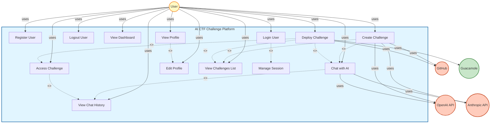
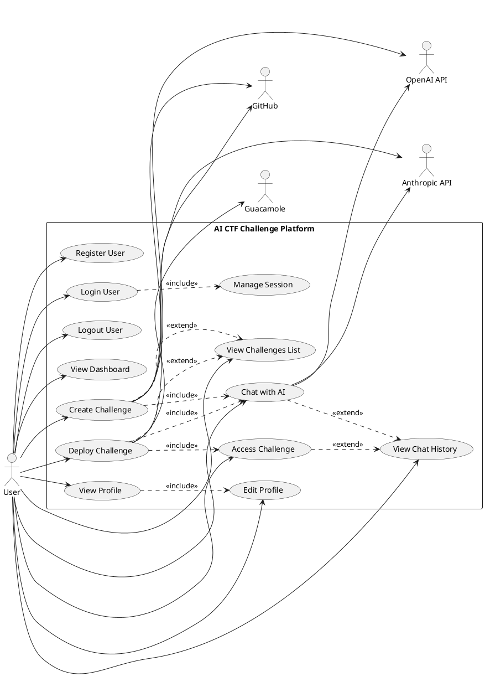

# AI CTF Challenge Platform - Use Case Diagram

## Use Case Diagram

---

## Use Case Descriptions

### Primary Use Cases

#### 1. **Register User**
- **Actor**: User
- **Description**: New user creates an account with email, username, and password
- **Preconditions**: User is not logged in
- **Postconditions**: User account created, user can login

#### 2. **Login User**
- **Actor**: User
- **Description**: User authenticates with credentials to access the platform
- **Preconditions**: User has an account
- **Postconditions**: User is authenticated, session created
- **Includes**: Manage Session

#### 3. **Logout User**
- **Actor**: User
- **Description**: User ends their session and logs out
- **Preconditions**: User is logged in
- **Postconditions**: Session destroyed, user logged out

#### 4. **View Dashboard**
- **Actor**: User
- **Description**: User views the main dashboard with platform overview
- **Preconditions**: User is logged in
- **Postconditions**: Dashboard displayed

#### 5. **Create Challenge**
- **Actor**: User, OpenAI API, Anthropic API, GitHub
- **Description**: User requests AI to create a new CTF challenge via chat
- **Preconditions**: User is logged in
- **Postconditions**: Challenge created and stored in GitHub repository
- **Includes**: Chat with AI
- **Extends**: View Challenges List

#### 6. **Deploy Challenge**
- **Actor**: User, GitHub, Guacamole
- **Description**: User requests to deploy an existing challenge, creating containers and access
- **Preconditions**: Challenge exists, user is logged in
- **Postconditions**: Challenge deployed, containers running, Guacamole access created
- **Includes**: Chat with AI, Access Challenge
- **Extends**: View Challenges List

#### 7. **Chat with AI**
- **Actor**: User, OpenAI API, Anthropic API
- **Description**: User interacts with AI assistant for challenge creation, deployment, or questions
- **Preconditions**: User is logged in
- **Postconditions**: Chat message sent, AI response received
- **Extends**: View Chat History

#### 8. **View Chat History**
- **Actor**: User
- **Description**: User views previous chat conversations
- **Preconditions**: User is logged in, has chat history
- **Postconditions**: Chat history displayed

#### 9. **Access Challenge**
- **Actor**: User, Guacamole
- **Description**: User accesses deployed challenge via browser-based SSH/RDP through Guacamole
- **Preconditions**: Challenge is deployed, user is logged in
- **Postconditions**: User has terminal access to challenge containers
- **Extends**: View Chat History

#### 10. **View Profile**
- **Actor**: User
- **Description**: User views their profile information
- **Preconditions**: User is logged in
- **Postconditions**: Profile information displayed
- **Includes**: Edit Profile

#### 11. **Edit Profile**
- **Actor**: User
- **Description**: User updates their profile information (name, avatar, password)
- **Preconditions**: User is logged in
- **Postconditions**: Profile updated

#### 12. **View Challenges List**
- **Actor**: User
- **Description**: User views list of available challenges
- **Preconditions**: User is logged in
- **Postconditions**: Challenges list displayed

#### 13. **Manage Session**
- **Actor**: System
- **Description**: System manages user session (create, validate, regenerate, destroy)
- **Preconditions**: User is authenticating or authenticated
- **Postconditions**: Session managed appropriately

---

## Relationships

### Include Relationships (<<include>>)
- **Login User** includes **Manage Session** (mandatory)
- **Create Challenge** includes **Chat with AI** (mandatory)
- **Deploy Challenge** includes **Chat with AI** (mandatory)
- **Deploy Challenge** includes **Access Challenge** (mandatory)
- **View Profile** includes **Edit Profile** (mandatory)

### Extend Relationships (<<extend>>)
- **Chat with AI** extends **View Chat History** (optional)
- **Create Challenge** extends **View Challenges List** (optional)
- **Deploy Challenge** extends **View Challenges List** (optional)
- **Access Challenge** extends **View Chat History** (optional)

---

## Actors

### Primary Actor
- **User**: The main user of the system who creates, deploys, and accesses CTF challenges

### External Actors
- **OpenAI API**: Provides AI-powered challenge generation and assistance
- **Anthropic API**: Provides AI validation and error analysis
- **GitHub**: Stores challenge repositories and files
- **Guacamole**: Provides browser-based SSH/RDP access to challenge containers

---

## Use Case Diagram in PlantUML Format

---

## Summary

**Total Use Cases**: 13
**Primary Actor**: User
**External Actors**: 4 (OpenAI API, Anthropic API, GitHub, Guacamole)
**Include Relationships**: 5
**Extend Relationships**: 4

---

**Last Updated**: 2025-01-27  
**Version**: 1.0

