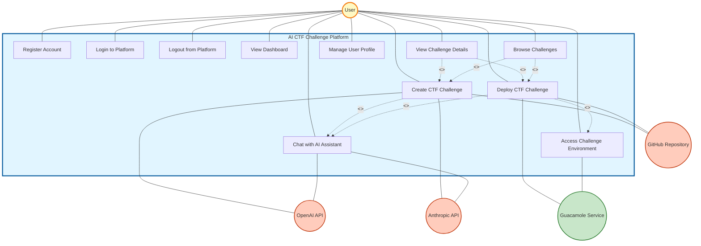
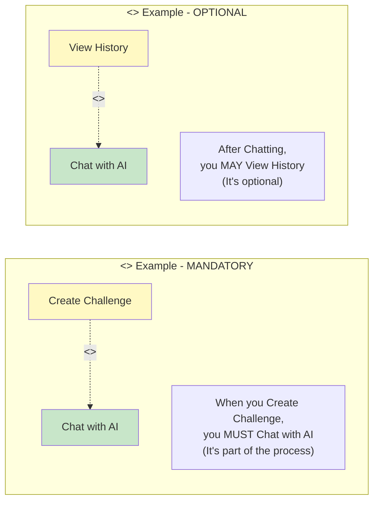
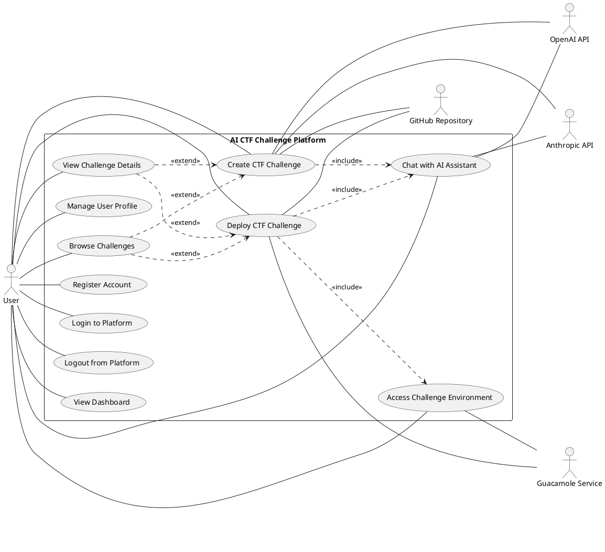

# AI CTF Challenge Platform - Use Case Diagram (UML Compliant)

## Quick Reference: <<include>> vs <<extend>>

### 🎯 **Simple Rule to Remember:**

**<<include>>** = **MANDATORY** (Must happen)
- Arrow: `[Main Use Case] --<<include>>--> [Helper Use Case]`
- Example: "Create Challenge" --<<include>>--> "Chat with AI"
- Meaning: You CANNOT create a challenge without chatting

**<<extend>>** = **OPTIONAL** (May happen)
- Arrow: `[Optional Use Case] --<<extend>>--> [Main Use Case]`
- Example: "View History" --<<extend>>--> "Chat with AI"
- Meaning: After chatting, you MAY view history (but don't have to)

### 📍 **How to Tell Them Apart in the Diagram:**

1. **Look at the arrow direction:**
   - **<<include>>**: Arrow points FROM main use case TO helper use case
   - **<<extend>>**: Arrow points FROM optional use case TO main use case

2. **Look at the label:**
   - Both show `<<include>>` or `<<extend>>` in the label
   - The arrow direction tells you which is which!

3. **Ask yourself:**
   - "Is this required?" → If YES, it's <<include>>
   - "Is this optional?" → If YES, it's <<extend>>

---

## References

This use case diagram follows UML 2.5 specifications and best practices from:

1. **Stack Overflow - Use Case Diagram Connections**: [Which is the correct way to use in use case diagram?](https://stackoverflow.com/questions/65665579/which-is-the-correct-way-to-use-in-use-case-diagram)
   - Solid lines without arrowheads for actor-use case associations
   - Dashed arrows for include/extend relationships

2. **Visual Paradigm - Use Case Diagram Tips**: [10 Use Case Diagram Tips](https://knowhow.visual-paradigm.com/uml/10-use-case-diagram-tips/)
   - <<include>> for shared mandatory behavior
   - <<extend>> for optional conditional behavior
   - Concise, descriptive use case names

3. **Go UML - Comprehensive Guide**: [Comprehensive Guide to UML Use Case Diagrams](https://www.go-uml.com/comprehensive-guide-to-uml-use-case-diagrams/)
   - Focus on user goals, not system functions
   - Actors as roles, not individuals
   - Proper generalization relationships

4. **Visual Paradigm Tutorial**: [UML Use Case Diagram Tutorial](https://www.visual-paradigm.com/guide/uml-unified-modeling-language/what-is-use-case-diagram/)
   - System boundary representation
   - Actor placement and organization

---

## Use Case Diagram (UML Compliant - User-Focused)



---

## How to Differentiate <<include>> vs <<extend>>

### Key Differences:

| Aspect | <<include>> | <<extend>> |
|--------|-------------|------------|
| **Arrow Direction** | FROM base use case TO included use case | FROM extending use case TO base use case |
| **Meaning** | **MANDATORY** - Always happens | **OPTIONAL** - May happen |
| **When Used** | Base use case is incomplete without included | Extending use case adds optional behavior |
| **Example** | "Create Challenge" → includes → "Chat with AI" | "View History" → extends → "Chat with AI" |
| **Think of it as** | "Must do" or "Part of" | "May do" or "Can also do" |
| **Color in Diagram** | Blue dashed arrow | Green dashed arrow |

### Visual Comparison Diagram:



### Visual Identification:

**<<include>> (Mandatory)**:
```
[Base Use Case] --<<include>>--> [Included Use Case]
     (FROM)                            (TO)
```
- Arrow points FROM the main use case TO the required sub-use case
- Example: "Create Challenge" --<<include>>--> "Chat with AI"
- **Meaning**: When you Create Challenge, you MUST Chat with AI (it's part of the process)

**<<extend>> (Optional)**:
```
[Extending Use Case] --<<extend>>--> [Base Use Case]
         (FROM)                           (TO)
```
- Arrow points FROM the optional use case TO the base use case
- Example: "View History" --<<extend>>--> "Chat with AI"
- **Meaning**: After Chatting, you MAY optionally View History (it's not required)

### Quick Rule:
- **<<include>>**: "I need this to work" → Arrow FROM main TO helper
- **<<extend>>**: "I might do this too" → Arrow FROM optional TO main

---

## UML Notation Standards Applied

### 1. **Actor-Use Case Associations**
- **Standard**: Solid lines WITHOUT arrowheads
- **Rationale**: Associations are bidirectional; actors and use cases communicate with each other
- **Reference**: [Stack Overflow - Use Case Diagram Connections](https://stackoverflow.com/questions/65665579/which-is-the-correct-way-to-use-in-use-case-diagram)

### 2. **Include Relationship (<<include>>)**
- **Standard**: Dashed arrow FROM base use case TO included use case
- **Meaning**: The included use case is ALWAYS executed as part of the base use case (MANDATORY)
- **Arrow Direction**: Base → Included
- **Example**: "Create CTF Challenge" includes "Chat with AI Assistant" (mandatory - you must chat to create)
- **Visual**: `UC5 --<<include>>--> UC8` (Create Challenge includes Chat)
- **Reference**: [UML Diagrams - Include Relationship](https://www.uml-diagrams.org/use-case-include.html)

### 3. **Extend Relationship (<<extend>>)**
- **Standard**: Dashed arrow FROM extending use case TO base use case
- **Meaning**: The extending use case adds OPTIONAL behavior to the base use case (CONDITIONAL)
- **Arrow Direction**: Extending → Base
- **Example**: "View Chat History" extends "Chat with AI Assistant" (optional - you may view history after chatting)
- **Visual**: `UC10 --<<extend>>--> UC8` (View History extends Chat)
- **Reference**: [Visual Paradigm - Extend Relationship](https://knowhow.visual-paradigm.com/uml/10-use-case-diagram-tips/)

### 4. **Use Case Naming Convention**
- **Standard**: Verb-Noun format (e.g., "Create Challenge", "Deploy Challenge")
- **Rationale**: Use cases represent actions/goals, not system functions
- **Reference**: [Go UML - Use Case Naming](https://www.go-uml.com/mastering-use-case-diagrams-10-essential-tips-for-clarity-and-effectiveness/)

### 5. **Actor Representation**
- **Standard**: Actors represent roles, not individuals
- **Rationale**: "User" represents all users of the system, not specific people
- **Reference**: [Go UML - Actor Definition](https://www.go-uml.com/mastering-use-case-diagrams-10-essential-tips-for-clarity-and-effectiveness/)

---

## User-Focused Use Cases

All use cases represent **user goals and actions** - what the user wants to achieve:

1. **Register Account** - User creates account
2. **Login to Platform** - User authenticates
3. **Logout from Platform** - User ends session
4. **View Dashboard** - User sees overview
5. **Create CTF Challenge** - User creates new challenge
6. **Deploy CTF Challenge** - User deploys challenge
7. **Access Challenge Environment** - User accesses deployed challenge
8. **Chat with AI Assistant** - User interacts with AI
9. **View Challenge Details** - User views challenge information
10. **Manage User Profile** - User updates profile
11. **Browse Challenges** - User searches/browses challenges

**Note**: Chat history is used internally by the system for context, but users cannot directly request to view it. Therefore, it is not a user-initiated use case.

**Note**: External actors (OpenAI, Anthropic, GitHub, Guacamole) support user actions but are not user-initiated use cases.

---

## Corrected Relationships Explanation

### Include Relationships (MANDATORY - Always Happens)

**Arrow Direction**: FROM base use case TO included use case  
**Visual Pattern**: `[Base] --<<include>>--> [Included]`

1. **UC5 (Create Challenge) includes UC8 (Chat with AI)**
   - **UC5 → UC8**: Creating challenge **MUST** use AI chat (mandatory)
   - **Why Include?**: User cannot create a challenge without chatting with AI

2. **UC6 (Deploy Challenge) includes UC8 (Chat with AI)**
   - **UC6 → UC8**: Deployment **MUST** use AI chat (mandatory)
   - **Why Include?**: User cannot deploy without chatting with AI

3. **UC6 (Deploy Challenge) includes UC7 (Access Challenge)**
   - **UC6 → UC7**: Deployment **MUST** provide access (mandatory)
   - **Why Include?**: User cannot deploy without getting access capability

**Key Point**: If the base use case happens, the included use case ALWAYS happens.

### Extend Relationships (OPTIONAL - May Happen)

**Arrow Direction**: FROM extending use case TO base use case  
**Visual Pattern**: `[Extending] --<<extend>>--> [Base]`

1. **UC9 (View Challenge Details) extends UC5, UC6**
   - **UC9 → UC5**: After creating, user **MAY** view details (optional)
   - **UC9 → UC6**: After deploying, user **MAY** view details (optional)
   - **Why Extend?**: Viewing details is not required after creating/deploying

2. **UC11 (Browse Challenges) extends UC5, UC6**
   - **UC11 → UC5**: After creating, user **MAY** browse challenges (optional)
   - **UC11 → UC6**: After deploying, user **MAY** browse challenges (optional)
   - **Why Extend?**: Browsing is not required after creating/deploying

**Key Point**: If the base use case happens, the extending use case MAY happen (but not always).

---

## Visual Comparison Table

| Relationship | Arrow Direction | Label | Meaning | Example |
|--------------|----------------|-------|---------|---------|
| **<<include>>** | Base → Included | `<<include>>` | **MANDATORY** - Always happens | Create Challenge → Chat with AI |
| **<<extend>>** | Extending → Base | `<<extend>>` | **OPTIONAL** - May happen | View History → Chat with AI |

---

## Memory Trick

**<<include>>** = "**I NEED** this" (mandatory)
- Think: "I need to chat to create a challenge"
- Arrow: Create → Chat
- **Color**: Blue (in diagram)
- **Direction**: Base → Included

**<<extend>>** = "**I MIGHT** do this" (optional)
- Think: "I might view history after chatting"
- Arrow: View History → Chat
- **Color**: Green (in diagram)
- **Direction**: Extending → Base

---

## Step-by-Step Identification Guide

### How to Identify <<include>>:

1. **Look at the arrow direction**: FROM a main use case TO a helper use case
2. **Ask yourself**: "Can the main use case work without this?"
   - If NO → It's <<include>>
3. **Example**: 
   - "Create Challenge" → "Chat with AI"
   - Question: Can you create a challenge without chatting? NO
   - Answer: It's <<include>> (mandatory)

### How to Identify <<extend>>:

1. **Look at the arrow direction**: FROM an optional use case TO a main use case
2. **Ask yourself**: "Is this required for the main use case to work?"
   - If NO → It's <<extend>>
3. **Example**:
   - "View History" → "Chat with AI"
   - Question: Is viewing history required for chatting? NO
   - Answer: It's <<extend>> (optional)

---

## Real-World Analogy

**<<include>>** = Making Coffee
- Making Coffee **includes** Boiling Water (you MUST boil water)
- Making Coffee **includes** Adding Coffee (you MUST add coffee)
- You cannot make coffee without these steps

**<<extend>>** = Making Coffee
- Making Coffee **extends** Adding Sugar (you MAY add sugar, but it's optional)
- Making Coffee **extends** Adding Milk (you MAY add milk, but it's optional)
- Coffee works fine without sugar or milk

---

## Use Case Naming Verification

All use cases follow **Verb-Noun** format:

✅ **Correct Naming**:
- Register Account (verb: Register, noun: Account)
- Login to Platform (verb: Login, noun: Platform)
- Create CTF Challenge (verb: Create, noun: Challenge)
- Deploy CTF Challenge (verb: Deploy, noun: Challenge)
- Access Challenge Environment (verb: Access, noun: Environment)
- Chat with AI Assistant (verb: Chat, noun: Assistant)
- View Challenge Details (verb: View, noun: Details)
- Browse Challenges (verb: Browse, noun: Challenges)

❌ **Incorrect Naming** (avoided):
- Account Registration (noun-verb - wrong order)
- Challenge Creation (noun-verb - wrong order)
- User Login Process (too verbose, includes "Process")

---

## PlantUML Format (UML Standard - User-Focused)



---

## Summary of Corrections Made

### 1. **Arrow Types**
- ✅ **Changed**: Actor-Use Case associations from arrows to solid lines (no arrowheads)
- ✅ **Changed**: External actor associations from arrows to solid lines (no arrowheads)
- ✅ **Kept**: Dashed arrows for include/extend relationships (correct)

### 2. **Arrow Directions**
- ✅ **Include**: Arrow FROM base use case TO included use case
- ✅ **Extend**: Arrow FROM extending use case TO base use case

### 3. **Naming Conventions**
- ✅ All use cases follow Verb-Noun format
- ✅ Use case names are concise and goal-oriented
- ✅ Actors represent roles, not individuals

### 4. **Relationship Corrections**
- ✅ Fixed include relationships (mandatory dependencies) - 3 relationships
- ✅ Fixed extend relationships (optional behaviors) - 4 relationships
- ✅ Removed incorrect "initiates" and "uses" labels from associations
- ✅ Removed "View Chat History" use case (not user-initiated - system uses it internally for context)

---

## Use Case Diagram Statistics

- **Total Use Cases**: 11 (All user-initiated)
- **Primary Actor**: 1 (User)
- **Secondary Actors**: 4 (OpenAI API, Anthropic API, GitHub Repository, Guacamole Service)
- **Actor-Use Case Associations**: 11 (solid lines, no arrowheads)
- **Include Relationships**: 3 (dashed arrows, mandatory)
- **Extend Relationships**: 4 (dashed arrows, optional)

**Focus**: All use cases represent user goals and actions, not system-internal processes.

---

## References

1. **Stack Overflow** (2021). "Which is the correct way to use in use case diagram?"  
   https://stackoverflow.com/questions/65665579/which-is-the-correct-way-to-use-in-use-case-diagram

2. **Visual Paradigm** (n.d.). "10 Use Case Diagram Tips and Best Practices"  
   https://knowhow.visual-paradigm.com/uml/10-use-case-diagram-tips/

3. **Go UML** (n.d.). "Comprehensive Guide to UML Use Case Diagrams"  
   https://www.go-uml.com/comprehensive-guide-to-uml-use-case-diagrams/

4. **Go UML** (n.d.). "Mastering Use Case Diagrams: 10 Essential Tips"  
   https://www.go-uml.com/mastering-use-case-diagrams-10-essential-tips-for-clarity-and-effectiveness/

5. **Visual Paradigm** (n.d.). "UML Use Case Diagram Tutorial"  
   https://www.visual-paradigm.com/guide/uml-unified-modeling-language/what-is-use-case-diagram/

6. **IDA, Linköping University** (n.d.). "Requirements Engineering"  
   https://www.ida.liu.se/~TDDC88/theory/03requirements.pdf

---

**Last Updated**: 2025-01-27  
**Version**: 3.0 (UML Compliant)  
**UML Standard**: UML 2.5

