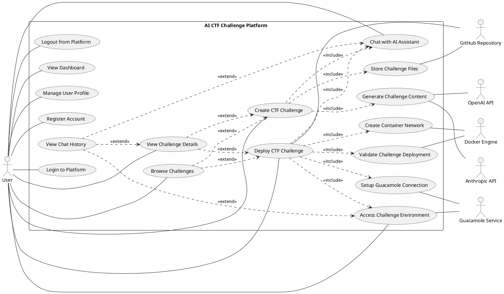

# AI CTF Challenge Platform - Use Case Diagram (UML Compliant)

## References

This use case diagram follows UML 2.5 specifications and best practices from:

1. **Stack Overflow - Use Case Diagram Connections**: [Which is the correct way to use in use case diagram?](https://stackoverflow.com/questions/65665579/which-is-the-correct-way-to-use-in-use-case-diagram)
   - Solid lines without arrowheads for actor-use case associations
   - Dashed arrows for include/extend relationships

2. **Visual Paradigm - Use Case Diagram Tips**: [10 Use Case Diagram Tips](https://knowhow.visual-paradigm.com/uml/10-use-case-diagram-tips/)
   - <<include>> for shared mandatory behavior
   - <<extend>> for optional conditional behavior
   - Concise, descriptive use case names

3. **Go UML - Comprehensive Guide**: [Comprehensive Guide to UML Use Case Diagrams](https://www.go-uml.com/comprehensive-guide-to-uml-use-case-diagrams/)
   - Focus on user goals, not system functions
   - Actors as roles, not individuals
   - Proper generalization relationships

4. **Visual Paradigm Tutorial**: [UML Use Case Diagram Tutorial](https://www.visual-paradigm.com/guide/uml-unified-modeling-language/what-is-use-case-diagram/)
   - System boundary representation
   - Actor placement and organization

---

## Use Case Diagram (UML Compliant)

```mermaid
graph TB
    subgraph System["AI CTF Challenge Platform"]
        UC1[Register Account]
        UC2[Login to Platform]
        UC3[Logout from Platform]
        UC4[View Dashboard]
        UC5[Create CTF Challenge]
        UC6[Deploy CTF Challenge]
        UC7[Access Challenge Environment]
        UC8[Chat with AI Assistant]
        UC9[View Challenge Details]
        UC10[View Chat History]
        UC11[Manage User Profile]
        UC12[Browse Challenges]
        UC13[Validate Challenge Deployment]
        UC14[Generate Challenge Content]
        UC15[Store Challenge Files]
        UC16[Create Container Network]
        UC17[Setup Guacamole Connection]
    end

    User((User))
    OpenAI((OpenAI API))
    Anthropic((Anthropic API))
    GitHub((GitHub Repository))
    Guacamole((Guacamole Service))
    Docker((Docker Engine))

    %% Actor-Use Case Associations (Solid lines, NO arrowheads - UML Standard)
    User --- UC1
    User --- UC2
    User --- UC3
    User --- UC4
    User --- UC5
    User --- UC6
    User --- UC7
    User --- UC8
    User --- UC9
    User --- UC11
    User --- UC12

    %% Include Relationships (Dashed arrow FROM base TO included use case)
    UC5 -.->|<<include>>| UC8
    UC5 -.->|<<include>>| UC14
    UC5 -.->|<<include>>| UC15
    UC6 -.->|<<include>>| UC8
    UC6 -.->|<<include>>| UC13
    UC6 -.->|<<include>>| UC16
    UC6 -.->|<<include>>| UC17
    UC6 -.->|<<include>>| UC7

    %% Extend Relationships (Dashed arrow FROM extending TO base use case)
    UC12 -.->|<<extend>>| UC5
    UC12 -.->|<<extend>>| UC6
    UC10 -.->|<<extend>>| UC8
    UC10 -.->|<<extend>>| UC7
    UC10 -.->|<<extend>>| UC9
    UC9 -.->|<<extend>>| UC5
    UC9 -.->|<<extend>>| UC6

    %% External Actor Associations (Solid lines, NO arrowheads)
    UC14 --- OpenAI
    UC14 --- Anthropic
    UC15 --- GitHub
    UC6 --- GitHub
    UC13 --- Docker
    UC16 --- Docker
    UC17 --- Guacamole
    UC7 --- Guacamole

    style System fill:#e1f5ff,stroke:#01579b,stroke-width:3px
    style User fill:#fff9c4,stroke:#f57f17,stroke-width:2px
    style OpenAI fill:#ffccbc,stroke:#bf360c,stroke-width:2px
    style Anthropic fill:#ffccbc,stroke:#bf360c,stroke-width:2px
    style GitHub fill:#ffccbc,stroke:#bf360c,stroke-width:2px
    style Guacamole fill:#c8e6c9,stroke:#2e7d32,stroke-width:2px
    style Docker fill:#90caf9,stroke:#0d47a1,stroke-width:2px
```

---

## UML Notation Standards Applied

### 1. **Actor-Use Case Associations**
- **Standard**: Solid lines WITHOUT arrowheads
- **Rationale**: Associations are bidirectional; actors and use cases communicate with each other
- **Reference**: [Stack Overflow - Use Case Diagram Connections](https://stackoverflow.com/questions/65665579/which-is-the-correct-way-to-use-in-use-case-diagram)

### 2. **Include Relationship (<<include>>)**
- **Standard**: Dashed arrow FROM base use case TO included use case
- **Meaning**: The included use case is ALWAYS executed as part of the base use case
- **Example**: "Create CTF Challenge" includes "Chat with AI Assistant" (mandatory)
- **Reference**: [Visual Paradigm - Include Relationship](https://knowhow.visual-paradigm.com/uml/10-use-case-diagram-tips/)

### 3. **Extend Relationship (<<extend>>)**
- **Standard**: Dashed arrow FROM extending use case TO base use case
- **Meaning**: The extending use case adds OPTIONAL behavior to the base use case
- **Example**: "View Chat History" extends "Chat with AI Assistant" (optional)
- **Reference**: [Visual Paradigm - Extend Relationship](https://knowhow.visual-paradigm.com/uml/10-use-case-diagram-tips/)

### 4. **Use Case Naming Convention**
- **Standard**: Verb-Noun format (e.g., "Create Challenge", "Deploy Challenge")
- **Rationale**: Use cases represent actions/goals, not system functions
- **Reference**: [Go UML - Use Case Naming](https://www.go-uml.com/mastering-use-case-diagrams-10-essential-tips-for-clarity-and-effectiveness/)

### 5. **Actor Representation**
- **Standard**: Actors represent roles, not individuals
- **Rationale**: "User" represents all users of the system, not specific people
- **Reference**: [Go UML - Actor Definition](https://www.go-uml.com/mastering-use-case-diagrams-10-essential-tips-for-clarity-and-effectiveness/)

---

## Corrected Relationships Explanation

### Include Relationships (Mandatory Dependencies)

1. **UC5 (Create Challenge) includes UC8, UC14, UC15**
   - UC5 → UC8: Creating challenge requires AI chat
   - UC5 → UC14: Creating challenge requires content generation
   - UC5 → UC15: Creating challenge requires file storage

2. **UC6 (Deploy Challenge) includes UC8, UC13, UC16, UC17, UC7**
   - UC6 → UC8: Deployment requires AI chat
   - UC6 → UC13: Deployment requires validation
   - UC6 → UC16: Deployment requires network creation
   - UC6 → UC17: Deployment requires Guacamole setup
   - UC6 → UC7: Deployment requires access capability

### Extend Relationships (Optional Behaviors)

1. **UC12 (Browse Challenges) extends UC5, UC6**
   - After creating or deploying, user may optionally browse challenges

2. **UC10 (View Chat History) extends UC8, UC7, UC9**
   - User may optionally view chat history after chatting, accessing, or viewing details

3. **UC9 (View Challenge Details) extends UC5, UC6**
   - User may optionally view challenge details after creating or deploying

---

## Use Case Naming Verification

All use cases follow **Verb-Noun** format:

✅ **Correct Naming**:
- Register Account (verb: Register, noun: Account)
- Login to Platform (verb: Login, noun: Platform)
- Create CTF Challenge (verb: Create, noun: Challenge)
- Deploy CTF Challenge (verb: Deploy, noun: Challenge)
- Access Challenge Environment (verb: Access, noun: Environment)
- Chat with AI Assistant (verb: Chat, noun: Assistant)
- View Challenge Details (verb: View, noun: Details)
- Browse Challenges (verb: Browse, noun: Challenges)

❌ **Incorrect Naming** (avoided):
- Account Registration (noun-verb - wrong order)
- Challenge Creation (noun-verb - wrong order)
- User Login Process (too verbose, includes "Process")

---

## PlantUML Format (UML Standard)

---

## Summary of Corrections Made

### 1. **Arrow Types**
- ✅ **Changed**: Actor-Use Case associations from arrows to solid lines (no arrowheads)
- ✅ **Changed**: External actor associations from arrows to solid lines (no arrowheads)
- ✅ **Kept**: Dashed arrows for include/extend relationships (correct)

### 2. **Arrow Directions**
- ✅ **Include**: Arrow FROM base use case TO included use case
- ✅ **Extend**: Arrow FROM extending use case TO base use case

### 3. **Naming Conventions**
- ✅ All use cases follow Verb-Noun format
- ✅ Use case names are concise and goal-oriented
- ✅ Actors represent roles, not individuals

### 4. **Relationship Corrections**
- ✅ Fixed include relationships (mandatory dependencies) - 8 relationships
- ✅ Fixed extend relationships (optional behaviors) - 7 relationships
- ✅ Removed incorrect "initiates" and "uses" labels from associations
- ✅ Removed incorrect include relationship between Login and Register (Login doesn't include Register, it just requires registration to have occurred previously)

---

## Use Case Diagram Statistics

- **Total Use Cases**: 17
- **Primary Use Cases**: 12 (User-initiated)
- **Secondary Use Cases**: 5 (System-internal)
- **Primary Actor**: 1 (User)
- **Secondary Actors**: 5 (OpenAI API, Anthropic API, GitHub Repository, Guacamole Service, Docker Engine)
- **Actor-Use Case Associations**: 19 (solid lines, no arrowheads)
- **Include Relationships**: 8 (dashed arrows, mandatory)
- **Extend Relationships**: 7 (dashed arrows, optional)

---

## References

1. **Stack Overflow** (2021). "Which is the correct way to use in use case diagram?"  
   https://stackoverflow.com/questions/65665579/which-is-the-correct-way-to-use-in-use-case-diagram

2. **Visual Paradigm** (n.d.). "10 Use Case Diagram Tips and Best Practices"  
   https://knowhow.visual-paradigm.com/uml/10-use-case-diagram-tips/

3. **Go UML** (n.d.). "Comprehensive Guide to UML Use Case Diagrams"  
   https://www.go-uml.com/comprehensive-guide-to-uml-use-case-diagrams/

4. **Go UML** (n.d.). "Mastering Use Case Diagrams: 10 Essential Tips"  
   https://www.go-uml.com/mastering-use-case-diagrams-10-essential-tips-for-clarity-and-effectiveness/

5. **Visual Paradigm** (n.d.). "UML Use Case Diagram Tutorial"  
   https://www.visual-paradigm.com/guide/uml-unified-modeling-language/what-is-use-case-diagram/

6. **IDA, Linköping University** (n.d.). "Requirements Engineering"  
   https://www.ida.liu.se/~TDDC88/theory/03requirements.pdf

---

**Last Updated**: 2025-01-27  
**Version**: 3.0 (UML Compliant)  
**UML Standard**: UML 2.5

