# AI CTF Challenge Platform - Detailed Use Case Diagram

## Use Case Diagram

```mermaid
graph TB
    subgraph System["AI CTF Challenge Platform"]
        UC1[Register Account]
        UC2[Login to Platform]
        UC3[Logout from Platform]
        UC4[View Dashboard]
        UC5[Create CTF Challenge]
        UC6[Deploy CTF Challenge]
        UC7[Access Challenge Environment]
        UC8[Chat with AI Assistant]
        UC9[View Challenge Details]
        UC10[View Chat History]
        UC11[Manage User Profile]
        UC12[Browse Challenges]
        UC13[Validate Challenge Deployment]
        UC14[Generate Challenge Content]
        UC15[Store Challenge Files]
        UC16[Create Container Network]
        UC17[Setup Guacamole Connection]
    end

    User((User))
    OpenAI((OpenAI API))
    Anthropic((Anthropic API))
    GitHub((GitHub Repository))
    Guacamole((Guacamole Service))
    Docker((Docker Engine))

    %% Primary Actor - User Associations
    User -->|initiates| UC1
    User -->|initiates| UC2
    User -->|initiates| UC3
    User -->|initiates| UC4
    User -->|initiates| UC5
    User -->|initiates| UC6
    User -->|initiates| UC7
    User -->|initiates| UC8
    User -->|initiates| UC9
    User -->|initiates| UC11
    User -->|initiates| UC12

    %% Include Relationships (Mandatory)
    UC2 -.->|<<include>>| UC1
    UC5 -.->|<<include>>| UC8
    UC5 -.->|<<include>>| UC14
    UC5 -.->|<<include>>| UC15
    UC6 -.->|<<include>>| UC8
    UC6 -.->|<<include>>| UC13
    UC6 -.->|<<include>>| UC16
    UC6 -.->|<<include>>| UC17
    UC6 -.->|<<include>>| UC7
    UC11 -.->|<<include>>| UC2

    %% Extend Relationships (Optional)
    UC5 -.->|<<extend>>| UC12
    UC6 -.->|<<extend>>| UC12
    UC8 -.->|<<extend>>| UC10
    UC7 -.->|<<extend>>| UC10
    UC9 -.->|<<extend>>| UC10
    UC5 -.->|<<extend>>| UC9
    UC6 -.->|<<extend>>| UC9

    %% External Actor Associations
    UC14 -->|uses| OpenAI
    UC14 -->|uses| Anthropic
    UC15 -->|uses| GitHub
    UC6 -->|uses| GitHub
    UC13 -->|uses| Docker
    UC16 -->|uses| Docker
    UC17 -->|uses| Guacamole
    UC7 -->|uses| Guacamole

    style System fill:#e1f5ff,stroke:#01579b,stroke-width:3px
    style User fill:#fff9c4,stroke:#f57f17,stroke-width:2px
    style OpenAI fill:#ffccbc,stroke:#bf360c,stroke-width:2px
    style Anthropic fill:#ffccbc,stroke:#bf360c,stroke-width:2px
    style GitHub fill:#ffccbc,stroke:#bf360c,stroke-width:2px
    style Guacamole fill:#c8e6c9,stroke:#2e7d32,stroke-width:2px
    style Docker fill:#90caf9,stroke:#0d47a1,stroke-width:2px
```

---

## Detailed Use Case Specifications

### UC1: Register Account

**Use Case ID**: UC1  
**Use Case Name**: Register Account  
**Actor**: User  
**Priority**: High  
**Type**: Primary Use Case

**Description**:  
A new user creates an account in the AI CTF Challenge Platform by providing personal information including username, email address, password, and optional profile details such as name and avatar selection.

**Preconditions**:
- User is not currently logged in
- User has access to a valid email address
- Platform registration is enabled

**Postconditions**:
- New user account is created in the system
- User credentials are stored securely in PostgreSQL database
- User receives confirmation of successful registration
- User can proceed to login

**Main Flow**:
1. User navigates to the registration page
2. System displays registration form
3. User enters username, email, password, and optional profile information
4. System validates input data (email format, password strength, username uniqueness)
5. System hashes password using bcryptjs
6. System stores user information in PostgreSQL database
7. System generates JWT token for immediate authentication
8. System creates initial user session
9. System displays success message
10. User is redirected to dashboard

**Alternative Flows**:

**A1: Invalid Email Format**
- At step 4, if email format is invalid
- System displays error message: "Please enter a valid email address"
- Flow returns to step 3

**A2: Weak Password**
- At step 4, if password does not meet strength requirements
- System displays error message: "Password must be at least 8 characters"
- Flow returns to step 3

**A3: Username Already Exists**
- At step 4, if username is already taken
- System displays error message: "Username already exists"
- Flow returns to step 3

**A4: Email Already Registered**
- At step 4, if email is already registered
- System displays error message: "Email already registered"
- Flow returns to step 3

**Exception Flows**:

**E1: Database Connection Failure**
- At step 6, if database connection fails
- System displays error message: "Registration temporarily unavailable. Please try again later."
- Use case terminates

**E2: System Error**
- At any step, if system error occurs
- System logs error and displays generic error message
- Use case terminates

---

### UC2: Login to Platform

**Use Case ID**: UC2  
**Use Case Name**: Login to Platform  
**Actor**: User  
**Priority**: High  
**Type**: Primary Use Case

**Description**:  
An existing user authenticates to the platform by providing their email address and password. Upon successful authentication, the system creates a session and provides access to platform features.

**Preconditions**:
- User has a registered account
- User is not currently logged in

**Postconditions**:
- User is authenticated
- User session is created and stored
- JWT token is generated and provided to user
- User has access to platform features

**Main Flow**:
1. User navigates to login page
2. System displays login form
3. User enters email address and password
4. System validates input format
5. System queries PostgreSQL database for user account
6. System compares provided password with stored hash using bcryptjs
7. System verifies account is active and not locked
8. System generates JWT token with user information
9. System creates session record in database
10. System creates Guacamole user if it doesn't exist
11. System stores JWT token in user's browser
12. System redirects user to dashboard
13. System displays welcome message

**Alternative Flows**:

**A1: Invalid Credentials**
- At step 6, if password does not match
- System increments failed login attempts counter
- System displays error message: "Invalid email or password"
- If failed attempts >= 5, system locks account for 15 minutes
- Flow returns to step 3

**A2: Account Locked**
- At step 7, if account is locked
- System displays error message: "Account is locked. Please try again later."
- Use case terminates

**A3: Account Inactive**
- At step 7, if account is inactive
- System displays error message: "Account is inactive. Please contact administrator."
- Use case terminates

**Include Relationships**:
- **UC1: Register Account** - User must have registered account to login

**Exception Flows**:

**E1: Database Connection Failure**
- At step 5, if database connection fails
- System displays error message: "Login temporarily unavailable. Please try again later."
- Use case terminates

---

### UC3: Logout from Platform

**Use Case ID**: UC3  
**Use Case Name**: Logout from Platform  
**Actor**: User  
**Priority**: Medium  
**Type**: Primary Use Case

**Description**:  
An authenticated user ends their session and logs out from the platform, invalidating their current session and JWT token.

**Preconditions**:
- User is currently logged in
- User has an active session

**Postconditions**:
- User session is destroyed
- JWT token is invalidated
- User is logged out
- User is redirected to login page

**Main Flow**:
1. User clicks logout button
2. System prompts user for confirmation
3. User confirms logout
4. System invalidates JWT token
5. System destroys session record in database
6. System clears session cookie
7. System redirects user to login page
8. System displays logout confirmation message

**Alternative Flows**:

**A1: User Cancels Logout**
- At step 3, if user cancels
- System returns user to previous page
- Use case terminates

---

### UC4: View Dashboard

**Use Case ID**: UC4  
**Use Case Name**: View Dashboard  
**Actor**: User  
**Priority**: High  
**Type**: Primary Use Case

**Description**:  
User views the main dashboard which provides an overview of the platform including recent challenges, statistics, quick actions, and navigation to different sections.

**Preconditions**:
- User is logged in
- User has valid session

**Postconditions**:
- Dashboard is displayed with current information
- User can navigate to other platform features

**Main Flow**:
1. User navigates to dashboard (or is redirected after login)
2. System retrieves user information from database
3. System retrieves user's challenge statistics
4. System retrieves recent chat history
5. System retrieves list of available challenges
6. System displays dashboard with all information
7. User can interact with dashboard elements

**Alternative Flows**:

**A1: No Challenges Available**
- At step 5, if user has no challenges
- System displays empty state with message: "No challenges yet. Create your first challenge!"
- Flow continues to step 6

---

### UC5: Create CTF Challenge

**Use Case ID**: UC5  
**Use Case Name**: Create CTF Challenge  
**Actor**: User, OpenAI API, Anthropic API, GitHub Repository  
**Priority**: High  
**Type**: Primary Use Case

**Description**:  
User requests the AI system to create a new CTF challenge by describing their requirements through a chat interface. The system uses AI agents to generate challenge structure, content, Dockerfiles, and stores the challenge in a GitHub repository.

**Preconditions**:
- User is logged in
- User has valid session
- OpenAI and Anthropic API keys are configured
- GitHub repository access is configured

**Postconditions**:
- New CTF challenge is created
- Challenge files are stored in GitHub repository
- Challenge metadata is stored in PostgreSQL database
- User receives confirmation of challenge creation

**Main Flow**:
1. User navigates to challenge creation interface
2. User enters challenge request in chat (e.g., "Create an FTP challenge with weak credentials")
3. System saves user message to chat history
4. System forwards request to CTF Automation Service
5. Classifier Agent analyzes request and identifies intent as "CREATE"
6. System routes request to Create Agent
7. Create Agent sends request to OpenAI API to generate challenge structure
8. OpenAI API returns challenge structure and content
9. Create Agent sends structure to Anthropic API for validation
10. Anthropic API returns validation results
11. Create Agent generates Dockerfiles for all machines
12. Create Agent creates challenge directory structure
13. Create Agent commits files to local Git repository
14. Create Agent pushes challenge files to GitHub repository
15. GitHub confirms successful push
16. Create Agent stores challenge metadata in PostgreSQL
17. System returns success message to user
18. System displays challenge creation confirmation

**Include Relationships**:
- **UC8: Chat with AI Assistant** - Challenge creation requires AI chat interaction
- **UC14: Generate Challenge Content** - AI generates challenge content
- **UC15: Store Challenge Files** - Challenge files must be stored

**Extend Relationships**:
- **UC12: Browse Challenges** - User may browse challenges after creation
- **UC9: View Challenge Details** - User may view challenge details after creation

**Alternative Flows**:

**A1: AI Generation Failure**
- At step 7-8, if OpenAI API fails
- System retries API call (max 3 attempts)
- If all retries fail, system displays error message
- Flow returns to step 2

**A2: Validation Failure**
- At step 9-10, if Anthropic validation fails
- Create Agent requests OpenAI to regenerate content
- Flow returns to step 7

**A3: GitHub Push Failure**
- At step 14-15, if GitHub push fails
- System displays error message: "Failed to store challenge. Please try again."
- Flow returns to step 2

**Exception Flows**:

**E1: API Rate Limit Exceeded**
- At step 7 or 9, if API rate limit is exceeded
- System displays error message: "AI service temporarily unavailable. Please try again later."
- Use case terminates

**E2: Network Error**
- At any step involving external services, if network error occurs
- System displays error message: "Network error. Please check your connection."
- Use case terminates

---

### UC6: Deploy CTF Challenge

**Use Case ID**: UC6  
**Use Case Name**: Deploy CTF Challenge  
**Actor**: User, GitHub Repository, Docker Engine, Guacamole Service  
**Priority**: High  
**Type**: Primary Use Case

**Description**:  
User requests to deploy an existing CTF challenge. The system clones the challenge from GitHub, validates the configuration, creates Docker containers, sets up network isolation, configures Guacamole access, and provides the user with access URL.

**Preconditions**:
- User is logged in
- Challenge exists in GitHub repository
- Docker Engine is running
- Guacamole service is available
- Challenge has valid docker-compose.yml file

**Postconditions**:
- Challenge containers are running
- Challenge network is created and isolated
- Guacamole connection is configured
- User receives access URL
- Challenge deployment status is updated in database

**Main Flow**:
1. User requests challenge deployment via chat (e.g., "Deploy challenge-name")
2. System saves user message to chat history
3. System forwards request to CTF Automation Service
4. Classifier Agent identifies intent as "DEPLOY"
5. System routes request to Deploy Agent
6. Deploy Agent retrieves challenge metadata from PostgreSQL
7. Deploy Agent clones challenge repository from GitHub
8. GitHub returns challenge files including docker-compose.yml
9. Deploy Agent calls Validator Agent for pre-deployment validation
10. Validator Agent validates Dockerfiles and docker-compose.yml
11. Validator Agent returns validation results
12. Deploy Agent allocates subnet and IP addresses for challenge network
13. Deploy Agent creates Docker network using Docker API
14. Docker Engine creates isolated network
15. Deploy Agent executes docker compose up --build command
16. Docker Engine builds container images
17. Docker Engine starts containers and attaches to network
18. Deploy Agent waits for containers to be healthy
19. Deploy Agent calls Validator Agent for post-deployment validation
20. Validator Agent tests container services and connectivity
21. Validator Agent returns validation results
22. Deploy Agent creates Guacamole user if needed
23. Deploy Agent creates Guacamole connection in MySQL database
24. Deploy Agent configures Guacamole connection parameters
25. Guacamole service creates connection
26. Deploy Agent updates challenge deployment status in PostgreSQL
27. System returns Guacamole access URL to user
28. System displays deployment success message with access link

**Include Relationships**:
- **UC8: Chat with AI Assistant** - Deployment requires AI chat interaction
- **UC13: Validate Challenge Deployment** - Deployment must be validated
- **UC16: Create Container Network** - Network must be created
- **UC17: Setup Guacamole Connection** - Guacamole access must be configured
- **UC7: Access Challenge Environment** - User must be able to access deployed challenge

**Extend Relationships**:
- **UC12: Browse Challenges** - User may browse challenges after deployment
- **UC9: View Challenge Details** - User may view challenge details after deployment

**Alternative Flows**:

**A1: Challenge Not Found**
- At step 6, if challenge doesn't exist
- System displays error message: "Challenge not found"
- Use case terminates

**A2: Pre-Deployment Validation Failure**
- At step 10-11, if validation fails
- Validator Agent attempts to fix errors automatically
- If fixes successful, flow continues to step 12
- If fixes fail, system displays error message
- Use case terminates

**A3: Container Build Failure**
- At step 16, if container build fails
- Deploy Agent analyzes error logs
- Deploy Agent requests OpenAI for error fix suggestions
- Deploy Agent attempts to fix and rebuild (max 3 attempts)
- If all attempts fail, system displays error message
- Use case terminates

**A4: Container Startup Failure**
- At step 17-18, if containers fail to start
- Deploy Agent checks container logs
- Deploy Agent restarts containers
- If still fails, system displays error message
- Use case terminates

**A5: Post-Deployment Validation Failure**
- At step 19-21, if services are not accessible
- Validator Agent identifies issues
- Deploy Agent fixes startup scripts and restarts containers
- Flow returns to step 19
- If fixes fail after 3 attempts, system displays error message
- Use case terminates

**Exception Flows**:

**E1: Docker Engine Unavailable**
- At step 13 or 15, if Docker Engine is unavailable
- System displays error message: "Container service unavailable. Please try again later."
- Use case terminates

**E2: Network Allocation Failure**
- At step 12, if no available subnet
- System displays error message: "No available network space. Please contact administrator."
- Use case terminates

---

### UC7: Access Challenge Environment

**Use Case ID**: UC7  
**Use Case Name**: Access Challenge Environment  
**Actor**: User, Guacamole Service  
**Priority**: High  
**Type**: Primary Use Case

**Description**:  
User accesses a deployed CTF challenge environment through browser-based SSH/RDP terminal provided by Guacamole. User can interact with attacker and victim containers to solve the challenge.

**Preconditions**:
- User is logged in
- Challenge is deployed and running
- Guacamole connection is configured
- User has valid Guacamole access credentials

**Postconditions**:
- User has active terminal session
- User can interact with challenge containers
- Session is logged for security

**Main Flow**:
1. User clicks on challenge access link
2. System retrieves Guacamole connection URL from database
3. System redirects user to Guacamole web interface
4. Guacamole authenticates user session
5. Guacamole establishes SSH connection to attacker container
6. Guacamole displays terminal interface in browser
7. User interacts with terminal (commands, file operations)
8. User can switch between attacker and victim containers
9. User performs challenge activities (scanning, exploitation, etc.)
10. User completes or exits challenge
11. System logs session activity

**Extend Relationships**:
- **UC10: View Chat History** - User may view chat history related to challenge access

**Alternative Flows**:

**A1: Connection Timeout**
- At step 5, if connection times out
- System displays error message: "Connection timeout. Please try again."
- Flow returns to step 1

**A2: Container Unavailable**
- At step 5, if container is not running
- System displays error message: "Challenge environment unavailable. Please redeploy."
- Use case terminates

---

### UC8: Chat with AI Assistant

**Use Case ID**: UC8  
**Use Case Name**: Chat with AI Assistant  
**Actor**: User, OpenAI API, Anthropic API  
**Priority**: High  
**Type**: Primary Use Case

**Description**:  
User interacts with AI assistant through a chat interface to create challenges, deploy challenges, ask questions about CTF concepts, or get assistance with challenge-related tasks.

**Preconditions**:
- User is logged in
- OpenAI and Anthropic API keys are configured
- Chat interface is available

**Postconditions**:
- Chat message is saved to database
- AI response is generated and displayed
- Chat history is updated

**Main Flow**:
1. User opens chat interface
2. User types message in chat input
3. User submits message
4. System saves user message to PostgreSQL database
5. System forwards message to CTF Automation Service
6. Classifier Agent analyzes message intent
7. System routes to appropriate agent (Create, Deploy, Questions)
8. Agent processes request using OpenAI or Anthropic API
9. AI API returns response
10. Agent formats response
11. System saves AI response to database
12. System displays response in chat interface
13. User can continue conversation

**Extend Relationships**:
- **UC10: View Chat History** - User may view previous chat conversations

**Alternative Flows**:

**A1: Ambiguous Intent**
- At step 6, if intent is unclear
- Questions Agent asks for clarification
- Flow returns to step 2

**A2: API Rate Limit**
- At step 8-9, if API rate limit exceeded
- System displays message: "AI service busy. Please try again in a moment."
- Flow returns to step 2

**Exception Flows**:

**E1: API Service Unavailable**
- At step 8, if API service is down
- System displays error message: "AI service temporarily unavailable."
- Use case terminates

---

### UC9: View Challenge Details

**Use Case ID**: UC9  
**Use Case Name**: View Challenge Details  
**Actor**: User  
**Priority**: Medium  
**Type**: Primary Use Case

**Description**:  
User views detailed information about a specific challenge including description, deployment status, creation date, access URL (if deployed), and related chat history.

**Preconditions**:
- User is logged in
- Challenge exists in system

**Postconditions**:
- Challenge details are displayed
- User can perform actions on challenge

**Main Flow**:
1. User selects challenge from list
2. System retrieves challenge metadata from PostgreSQL
3. System retrieves challenge deployment status
4. System retrieves related chat messages
5. System displays challenge details page
6. User can view all information
7. User can perform actions (deploy, delete, etc.)

**Extend Relationships**:
- **UC10: View Chat History** - User may view chat history related to challenge

---

### UC10: View Chat History

**Use Case ID**: UC10  
**Use Case Name**: View Chat History  
**Actor**: User  
**Priority**: Medium  
**Type**: Secondary Use Case

**Description**:  
User views previous chat conversations with the AI assistant, including messages related to challenge creation, deployment, or general questions.

**Preconditions**:
- User is logged in
- User has chat history

**Postconditions**:
- Chat history is displayed
- User can review previous conversations

**Main Flow**:
1. User navigates to chat history section
2. System retrieves user's chat messages from PostgreSQL
3. System filters messages by session or challenge
4. System displays chat history in chronological order
5. User can scroll through messages
6. User can search or filter messages

---

### UC11: Manage User Profile

**Use Case ID**: UC11  
**Use Case Name**: Manage User Profile  
**Actor**: User  
**Priority**: Medium  
**Type**: Primary Use Case

**Description**:  
User views and updates their profile information including name, avatar, email, and password.

**Preconditions**:
- User is logged in
- User has valid session

**Postconditions**:
- Profile information is updated
- Changes are saved to database

**Main Flow**:
1. User navigates to profile page
2. System retrieves user profile from PostgreSQL
3. System displays current profile information
4. User edits profile fields (name, avatar)
5. User saves changes
6. System validates input
7. System updates profile in database
8. System displays success message
9. Profile page refreshes with updated information

**Include Relationships**:
- **UC2: Login to Platform** - User must be logged in to manage profile

**Alternative Flows**:

**A1: Change Password**
- At step 4, if user changes password
- System prompts for current password
- System verifies current password
- System validates new password strength
- System hashes new password
- System updates password in database
- System invalidates all other sessions
- Flow continues to step 8

**A2: Invalid Current Password**
- At step A1.3, if current password is incorrect
- System displays error: "Current password is incorrect"
- Flow returns to step 4

---

### UC12: Browse Challenges

**Use Case ID**: UC12  
**Use Case Name**: Browse Challenges  
**Actor**: User  
**Priority**: Medium  
**Type**: Primary Use Case

**Description**:  
User browses through available CTF challenges in the system, viewing challenge list with filters and search functionality.

**Preconditions**:
- User is logged in

**Postconditions**:
- Challenge list is displayed
- User can select challenges to view or deploy

**Main Flow**:
1. User navigates to challenges page
2. System retrieves challenges from PostgreSQL
3. System applies filters if specified
4. System displays challenge list
5. User can search, filter, or sort challenges
6. User can select challenge for details or deployment

---

### UC13: Validate Challenge Deployment

**Use Case ID**: UC13  
**Use Case Name**: Validate Challenge Deployment  
**Actor**: Docker Engine  
**Priority**: High  
**Type**: Secondary Use Case

**Description**:  
System validates challenge deployment by checking Dockerfiles, docker-compose.yml, container health, and service accessibility before and after deployment.

**Preconditions**:
- Challenge files are available
- Docker Engine is running

**Postconditions**:
- Validation results are returned
- Errors are fixed if possible

**Main Flow**:
1. Validator Agent receives validation request
2. Agent reads Dockerfiles and docker-compose.yml
3. Agent checks syntax and structure
4. Agent validates container configurations
5. Agent tests container startup (if post-deployment)
6. Agent checks service accessibility
7. Agent returns validation results
8. If errors found, agent attempts automatic fixes
9. Agent returns fixed files or error report

---

### UC14: Generate Challenge Content

**Use Case ID**: UC14  
**Use Case Name**: Generate Challenge Content  
**Actor**: OpenAI API, Anthropic API  
**Priority**: High  
**Type**: Secondary Use Case

**Description**:  
AI agents generate CTF challenge content including structure, descriptions, vulnerabilities, and configurations using OpenAI and Anthropic APIs.

**Preconditions**:
- User request is received
- API keys are configured

**Postconditions**:
- Challenge content is generated
- Content is validated

**Main Flow**:
1. Create Agent receives challenge request
2. Agent formats prompt for OpenAI
3. Agent sends request to OpenAI API
4. OpenAI generates challenge structure and content
5. Agent receives generated content
6. Agent sends content to Anthropic for validation
7. Anthropic validates and suggests improvements
8. Agent incorporates improvements
9. Agent returns final challenge content

---

### UC15: Store Challenge Files

**Use Case ID**: UC15  
**Use Case Name**: Store Challenge Files  
**Actor**: GitHub Repository  
**Priority**: High  
**Type**: Secondary Use Case

**Description**:  
Challenge files including Dockerfiles, docker-compose.yml, README, and configuration files are stored in GitHub repository for version control and deployment.

**Preconditions**:
- Challenge files are generated
- GitHub access is configured

**Postconditions**:
- Challenge files are stored in GitHub
- Repository URL is returned

**Main Flow**:
1. Create Agent prepares challenge files
2. Agent initializes Git repository
3. Agent adds all challenge files
4. Agent commits files with message
5. Agent pushes to GitHub repository
6. GitHub confirms successful push
7. Agent receives repository URL
8. Agent stores URL in database

---

### UC16: Create Container Network

**Use Case ID**: UC16  
**Use Case Name**: Create Container Network  
**Actor**: Docker Engine  
**Priority**: High  
**Type**: Secondary Use Case

**Description**:  
System creates an isolated Docker network for challenge containers with allocated subnet and IP addresses.

**Preconditions**:
- Subnet is available
- Docker Engine is running

**Postconditions**:
- Network is created
- Network information is stored

**Main Flow**:
1. Deploy Agent allocates subnet (172.23.x.x/24)
2. Agent creates Docker network with subnet
3. Docker Engine creates network
4. Agent stores network information
5. Agent returns network details

---

### UC17: Setup Guacamole Connection

**Use Case ID**: UC17  
**Use Case Name**: Setup Guacamole Connection  
**Actor**: Guacamole Service, MySQL Database  
**Priority**: High  
**Type**: Secondary Use Case

**Description**:  
System configures Guacamole connection for user to access challenge containers via browser-based SSH/RDP.

**Preconditions**:
- Challenge is deployed
- Containers are running
- Guacamole service is available

**Postconditions**:
- Guacamole connection is created
- Access URL is generated

**Main Flow**:
1. Deploy Agent retrieves container IP addresses
2. Agent creates Guacamole user if needed
3. Agent creates connection record in MySQL
4. Agent sets connection parameters (hostname, port, protocol)
5. Agent grants user permissions
6. Guacamole service creates connection
7. Agent receives connection URL
8. Agent stores URL in database
9. Agent returns access URL

---

## Actors

### Primary Actor

**User**
- **Description**: The main user of the AI CTF Challenge Platform who creates, deploys, and accesses CTF challenges
- **Characteristics**: 
  - Has registered account
  - Uses web browser to access platform
  - Interacts with AI assistant via chat
  - Accesses challenge environments via Guacamole

### Secondary Actors

**OpenAI API**
- **Description**: External AI service providing GPT-4 for challenge content generation and error analysis
- **Role**: Provides AI-powered content generation and assistance

**Anthropic API**
- **Description**: External AI service providing Claude for challenge validation and error resolution
- **Role**: Provides AI-powered validation and analysis

**GitHub Repository**
- **Description**: External version control service storing challenge files and configurations
- **Role**: Stores and manages challenge repositories

**Guacamole Service**
- **Description**: Browser-based remote access service providing SSH/RDP access to challenge containers
- **Role**: Enables secure browser-based terminal access

**Docker Engine**
- **Description**: Containerization platform managing challenge containers and networks
- **Role**: Creates, manages, and orchestrates challenge containers

---

## Relationships Summary

### Include Relationships (<<include>>) - 8
- UC2 includes UC1 (Login requires Registration)
- UC5 includes UC8, UC14, UC15 (Create requires Chat, Generate, Store)
- UC6 includes UC8, UC13, UC16, UC17, UC7 (Deploy requires Chat, Validate, Network, Guacamole, Access)
- UC11 includes UC2 (Profile requires Login)

### Extend Relationships (<<extend>>) - 7
- UC5 extends UC12, UC9 (Create may lead to Browse, View Details)
- UC6 extends UC12, UC9 (Deploy may lead to Browse, View Details)
- UC8 extends UC10 (Chat may lead to View History)
- UC7 extends UC10 (Access may lead to View History)
- UC9 extends UC10 (View Details may lead to View History)

---

## Use Case Diagram Statistics

- **Total Use Cases**: 17
- **Primary Use Cases**: 12
- **Secondary Use Cases**: 5
- **Primary Actor**: 1 (User)
- **Secondary Actors**: 5 (OpenAI, Anthropic, GitHub, Guacamole, Docker)
- **Include Relationships**: 8
- **Extend Relationships**: 7

---

**Last Updated**: 2025-01-27  
**Version**: 2.0 (Detailed Specification)

